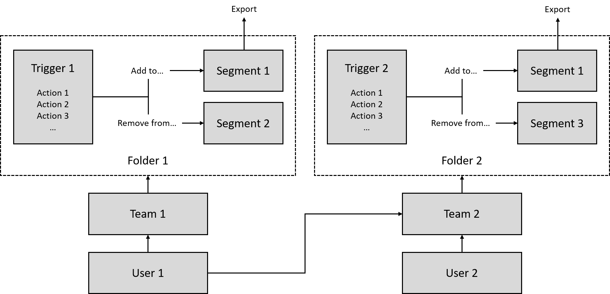

# Segmentation

## Concept Summary

| Concept | Description |
| :--- | :--- |
| [Triggers](triggers.md) | A set of user actions that determine when a user should be added or removed from a segment. |
| [Segments](segments.md) | A group of users, grouped together based on common actions \(triggers\). |
| [Folders](folders.md) | Triggers and segments can be added to folders, which in turns are accessible to teams; all so that you can control which users have access to which triggers. |

The conceptual drawing below may help you understand how the main concepts hang together. A user will have access to one or more teams, and teams have access to folders. So, whenever you would like to invite a user you can determine the triggers and segments they should have access to by giving them access to teams, and then connecting the team to specific folders of segments and triggers. 

A trigger determines the actions that a user must take in order to be added to, or removed from, a segment. Finally, segments can be exported to other systems that should activate the data. 

