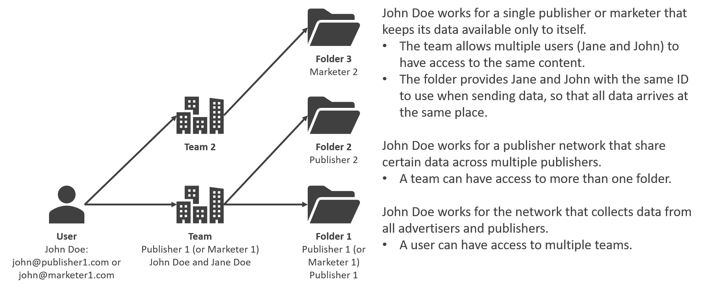

# Folders

Many parties, such as publishers and agencies, can upload their user information to Adnuntius Data, and folders ensure that these data will not be shared with anyway unless it's intensional. Any data sent by anyone is always sent to folders, and folders are accessible to users through teams.

**Name and description**. Give the trigger a name and description \(optional\) of your choice.

**Custom data** is used when exporting data to external systems. It allows you to, for example, attach some account identifier to the folder that can then be used by the data exporter.

**Team membership.** Teams are shared across Adnuntius Data and Adnuntius Advertising, and you will find full documentation on [how to create users, teams and roles](../../../adnuntius-advertising/admin-ui/admin/users-teams-and-roles.md) under the Adnuntius Advertising section. A team will determine which system users will have access to your folder. Once a user has access to a folder they can see the folder ID and then start sending data to that folder. 

