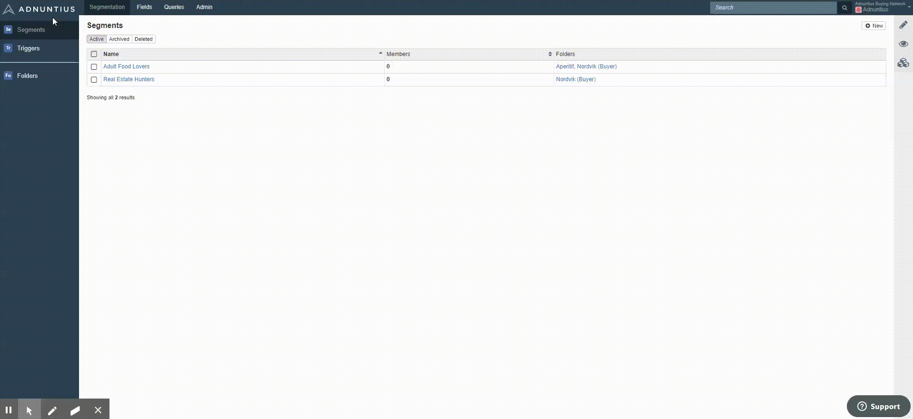

# Segments



To create a segment, go to [https://admin.adnuntius.com/segments](https://admin.adnuntius.com/segments) and click "new" in the upper right corner.

**Name and description**. Give the trigger a name and description \(optional\) of your choice. Members shows you how many users are currently part of this segment. 

**Segment expiry** allows you to specify for how long the segment should remain associated to a user profile. You can set the period in multiple ways:  

* You can set a fixed duration where you set a number of days, for instance 90 days. 
* You can let the segment expire after today, after this week or after this month.
* You can let the segment expire after a given weekday. For instance, a segment can last until Monday, which means that a user will no longer belong to a segment after Sunday, regardless of when that user was added.

**Segment sharing** allows you to determine whether a segment should be visible to anyone accessing Adnuntius, or to a specific folder. This is useful for a number of scenarios, but let’s do an example: if you run a network gathering multiple advertisers and publishers into one network, then you can allow user 1 access a folder containing segments derived from data collected from property 1, while user 2 can access a folder containing segments derived from data collected from property 2. Then as a super admin, you can access all segments across the entire network. 

Once a segment is created you be able to access graphs showing you, over any defined time period, how many users are added and how many are removed.

