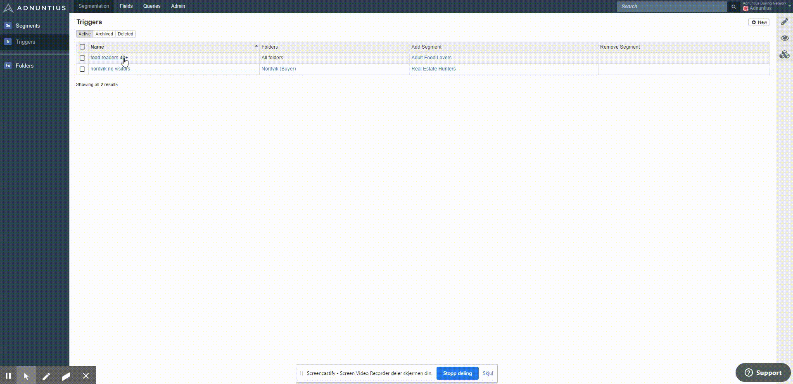

# Triggers

To create a trigger, go to [https://admin.adnuntius.com/triggers](https://admin.adnuntius.com/triggers) and click “New” in the upper right corner. 

**Name and description.** Give the trigger a name and description of your choice. 

**Folders**. Many parties, such as publishers and agencies, can upload their user information to Adnuntius Data, and folders ensure that these data will not be shared with anyone unless it's intensional. Any data sent by anyone is always sent to folders, and folders are accessible to users through teams. A trigger allows you to determine who \(which teams and users\) should have access to your trigger. [Read more about folders](folders.md). 

**Add and remove segments**. Based on users’ behaviour and characteristics you can add users to certain segments, or remove them. This enables you to build customer journeys. For example: if a user purchases a pair of loudspeakers from your hi-fi store, then you should perhaps immediately remove them from the “interested in loudspeakers” segment, but add them to the “interested in amplifiers” segment and the “interested in cables” segment \(since cables and amplifiers are natural upsales products based on the loudspeaker purchase\). 

You can also remove the segment automatically when the trigger does not match. 

Next, you can start creating the set of triggers that detemine when to add/remove users to/from segments. You can add behaviour and characteristics. 

**Characteristics** are based on [user profile information that you send to Adnuntius Data](). Examples include age, gender, age and much more. Depending on criteria you choose, you will be able to set more requirements. For example:

* If you choose the criteria “age” then you can choose anyone equal to, more than, less than, or not equal to “39”. 
* If you choose the criteria “gender” then you can choose between equals, doesn’t equal, is one of, or is not any of “male, female”. 

**Behavior** allows you to set requirements for what a user has seen during a period of time, and how many times. [You can send domain names, categories and keywords to Adnuntius Data](../../api-documentation/javascript/page-views.md), while device \(type and operation system\), location \(country, region and city\) and advertising actions \(clicks and conversions\) are sent automatically without you having to set it up. When sending behavioral information to Adnuntius Data you can set up criteria such as for example these: 

* Users who have visited the content category of football 3 times or more during the last 30 days. 
* Users who have been located in New York once or more during the last 7 days.


When you add text to profile fields, keywords or categories you can also add an asterisk to a word to ensure that Adnuntius picks up keywords and categories that **contain** the word you type. Here is what you can and cannot do:

* If you add the characteristics field "first name" to a trigger and type _rich\*,_ then both "rich" and "richard" will be added \(because "rich" is the first part of the word "richard"\).
* If you add the behavioral field "category" and type _\*sport,_ then for example _motorsport_ will be added_._
* If you add the behavioral field "keyword" and type _\*sport\*_ then for example _motorsports_ will be added. 
* Asterisks will not work when you add them to words that are shorter than 4 letters. For example, _\*car_ will not work.
* Asterisks in the middle of words will not work. For example, motor\*sport will not work. 


Finally, you can also choose whether users need to meet all of your criteria in order to be added to or removed from the segments, if they can meet any of the criteria, or if they must meet a specific combination. Combinations can include AND, OR, NOT and round brackets. Example: A AND \(B OR NOT\(C\)\).

When you hit Save the trigger is active and Adnuntius Data will start adding and removing users to/from segments.

