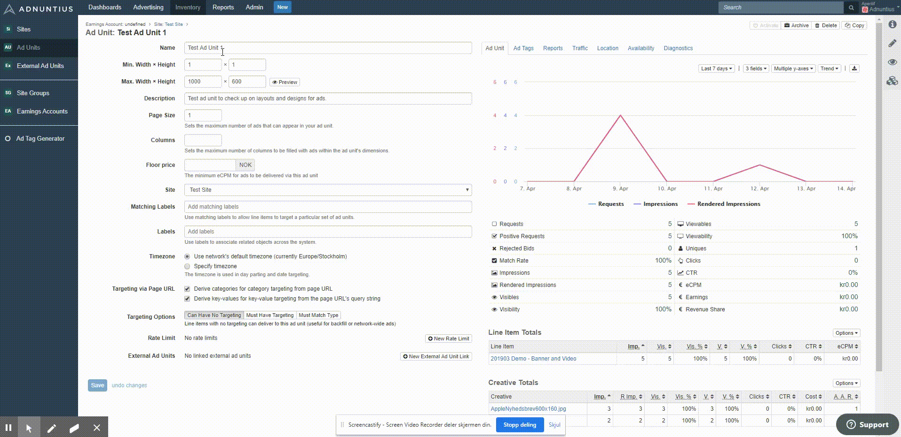

# Adnuntius Email Advertising

This guide assumes that you already have access an Adnuntius Advertising account \(or network\). If you don't, but would like one, please reach out to us at support@adnuntius.com and we will help you get started. 

<table>
  <thead>
    <tr>
      <th style="text-align:left">What and Why</th>
      <th style="text-align:left">Choices</th>
    </tr>
  </thead>
  <tbody>
    <tr>
      <td style="text-align:left">1 Create an earnings account. Earnings accounts let you aggregate earnings
        that one or more sites or newsletters have made. Here is how you create
        an earnings account.</td>
      <td style="text-align:left">
        
<a href="adnuntius-advertising/admin-ui/inventory/earnings-accounts.md">Documentation</a>
        

        
<a href="https://admin.adnuntius.com/earnings-accounts">Start creating</a>
        

      </td>
    </tr>
    <tr>
      <td style="text-align:left">2 Create your first site. A site can be the name of your newsletter, or
        any other grouping of your individual newsletter placements. Start by creating
        one site so that you learn the process, and then you can create more later.</td>
      <td
      style="text-align:left">
        
<a href="adnuntius-advertising/admin-ui/inventory/sites.md">Documentation</a>
        

        
<a href="https://admin.adnuntius.com/sites">Start creating</a>
        

        </td>
    </tr>
    <tr>
      <td style="text-align:left">3 Create an ad unit. Ad units are placement that can be inserted into
        your newsletter. Start by creating one ad unit so that you learn the process,
        and then you can create more later.</td>
      <td style="text-align:left">
        
<a href="adnuntius-advertising/admin-ui/inventory/adunits-1.md">Documentation</a>
        

        
<a href="https://admin.adnuntius.com/ad-units">Start creating</a>
        

      </td>
    </tr>
    <tr>
      <td style="text-align:left">4 Create an advertiser. An advertiser is a client that wants to advertise
        on your sites. If you have no advertisers yet, try creating your own company
        as an advertiser (which may be useful for house ads anyway).</td>
      <td style="text-align:left">
        
<a href="adnuntius-advertising/admin-ui/advertising/advertisers.md">Documentation</a>
        

        
<a href="https://admin.adnuntius.com/advertisers">Start creating</a>
        

      </td>
    </tr>
    <tr>
      <td style="text-align:left">5 Create an order. An advertiser can contain one or more orders. An order
        is also a folder for line items, and also determines which team that the
        campaign should belong to.</td>
      <td style="text-align:left">
        
<a href="adnuntius-advertising/admin-ui/advertising/orders.md">Documentation</a>
        

        
<a href="https://admin.adnuntius.com/orders">Start creating</a>
        

      </td>
    </tr>
    <tr>
      <td style="text-align:left">6 Create a line item (with targeting and creatives). A line item determines
        start and end dates, delivery objectives and more. Try targeting the creative
        to the ad unit you created in step 5, and remember to use a size that is
        supported by that ad unit.</td>
      <td style="text-align:left">
        
<a href="adnuntius-advertising/admin-ui/advertising/line-items.md">Documentation</a>
        

        
<a href="https://admin.adnuntius.com/line-items">Start creating</a>
        

      </td>
    </tr>
    <tr>
      <td style="text-align:left">7 Try to generate an ad impression using a service like <a href="https://www.w3schools.com/html/tryit.asp?filename=tryhtml_basic">Tryit</a>.
        Copy and paste your email ad tag from your ad unit into the body, and then
        click &quot;run&quot;. Is your ad showing?</td>
      <td style="text-align:left"><a href="https://www.w3schools.com/html/tryit.asp?filename=tryhtml_basic">Go to Tryit</a>
      </td>
    </tr>
  </tbody>
</table>Remember: when you create an ad unit and want to implement the tag into the newsletter, please remember to choose the "Email" tag alternative on the ad unit page \(see image below\). 

