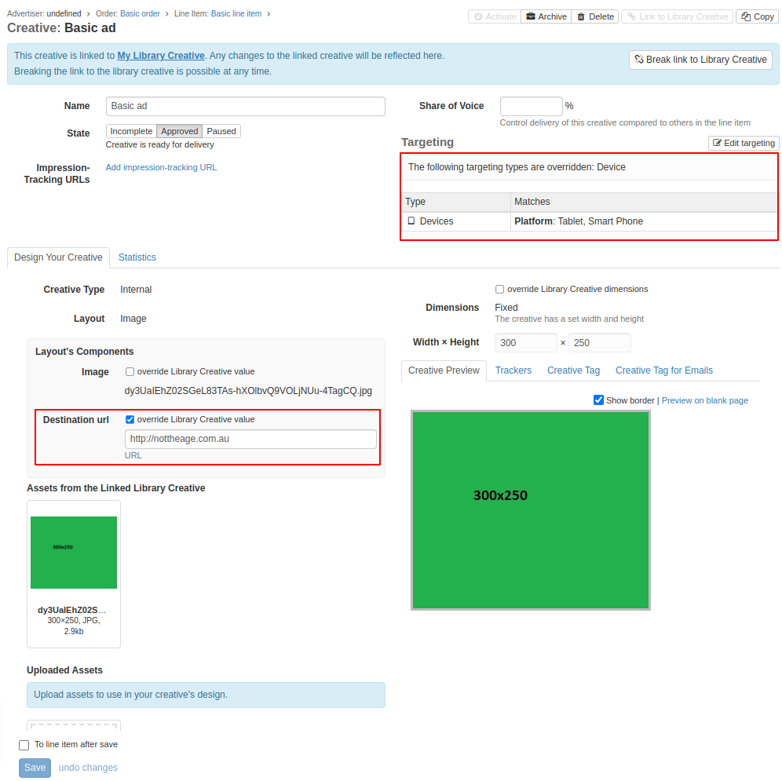

# Library Creatives

Library Creatives enable the same creative design to be used across multiple line items, all of which are editable via the Library Creative. An extra bonus is that an individual Creative that is linked to a Library Creative can override specific elements from the Library Creative's design yet still be tied to it.

## How to Work with Library Creatives

Library Creatives are created in much the same way as a [Creative](../../../../adnuntius-advertising/admin-ui/advertising/creatives.md).

Two differences are setting up what Teams have access to a Library Creative and the ability to create Creatives based off the Library Creative.

The Linked Creatives tab reveals all the Creatives that are based off the Linked Creative. Any updates to the Library Creative will then flow through to all the Creatives.

## How Creatives Linked to Library Creatives Work

Creatives linked to Library Creatives are highlighted as such and allow for individual fields to be overridden.

The two overrides in the Creative highlighted above mean that updates to the URL or device targeting in the Library Creative will not flow through here.


We are currently working to also support bulk upload of library creatives, to make it easier and faster to add multiple creatives to your library. Stay tuned for more!

