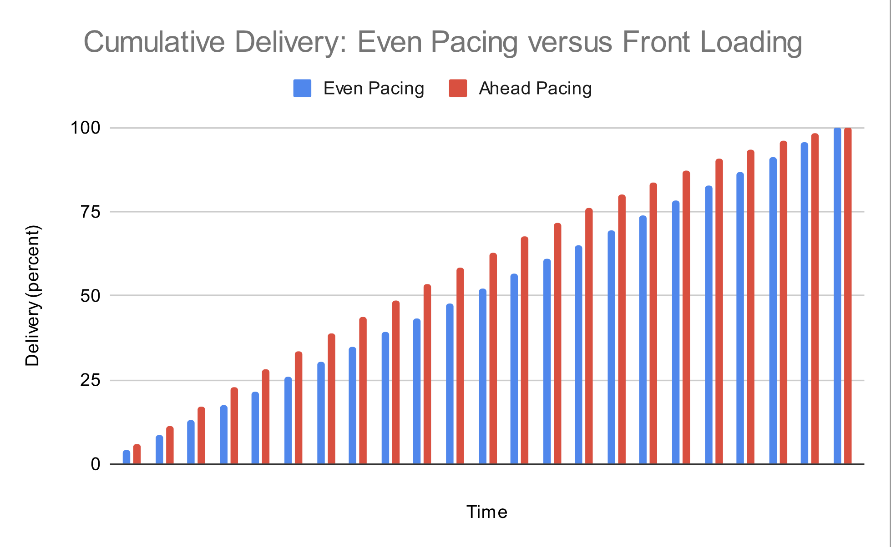

# Smoothing

Adnuntius provides two different options for smooth ad delivery:

* _Even Pacing_: where the system attempts to deliver at a constant rate throughout the campaign
* _Front Loaded Pacing_: where the system delivers more quickly at the beginning of the campaign

The impact of chosing _Front Loading_ is shown in the charts below.

Front Loading will cause your campaign to deliver up to 30% _faster_ at the beginning. Towards the end of the campaign the delivery will be relatively _slower_ compared to an evenly paced delivery.

Both _Even_ and _Front Loaded_ pacing strategies aim to deliver ads all the way up to the end of your campaign.

