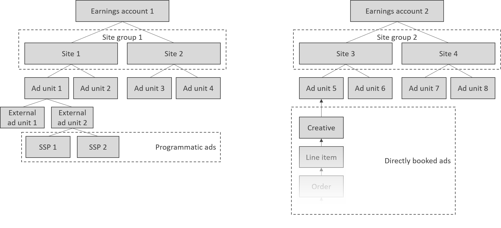

# Marketplace Inventory


Introduction to the inventory section.


## Concept Summary

| Name                                            | Description                                                                                                                                                                               |
| ----------------------------------------------- | ----------------------------------------------------------------------------------------------------------------------------------------------------------------------------------------- |
| [Publishers](earnings-accounts.md)              | Lets you aggregate earnings that one or more sites have made. Here is how you create an earnings account.                                                                                 |
| [Site group](site-groups.md)                    | Lets publishers group sites together to make targeting line items and/or creatives to multiple sites easier.                                                                              |
| [Site](sites.md)                                | A site or domain with a given name, containing one or more ad units.                                                                                                                      |
| [Ad Unit](adunits-1.md)                         | A placement that goes onto your site, so that you can later fill it with ads. It is as such an empty container that sets aside a space on your site so that you can fill it with content. |
| [Rulesets](site-rulesets.md) (work in progress) | Set different rules that should apply to your site or ad unit, i.e. floor price.                                                                                                          |
| [Blocklists](site-rulesets-1.md)                | Set rules for what you will allow on your site or ad unit, and what should be prohibited.                                                                                                 |
| [Ad tag generator](ad-tag-generator.md)         | When you have created your ad units, you can use the ad tag generator to get the codes ready for deployment.                                                                              |
| Proposals (work in progress)                    | A line item that has been submitted by a marketplace advertiser for review.                                                                                                               |

Here is how the various objects hang together: an earnings account and site group can both contain multiple sites; a site can contain multiple ad units, and ad units can connect to creatives (for direct advertising) or to external ad units (for programmatic ads).

