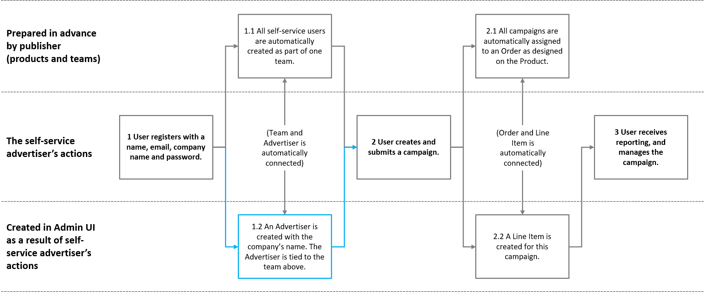

# Getting Started

This section assumes that you have an agreement with Adnuntius, and have been granted access to admin.adnuntius.com, and the self-service product. If you are looking for an offer, please contact us at [support@adnuntius.com](mailto:support@adnuntius.com) and we will help you out. There are three main steps to get started.

1. Create publishing inventory.
2. Set up your self-service portal.
3. Understand the system and workflow.

## Create Publishing Inventory

If you are already set up with Adnuntius Advertising and will not make any changes to your publishing inventory, you can skip this step.

| What and why                                                                                                                                                                                                                   | Choices                                                                                                                                                                             |
| ------------------------------------------------------------------------------------------------------------------------------------------------------------------------------------------------------------------------------ | ----------------------------------------------------------------------------------------------------------------------------------------------------------------------------------- |
| 1 Create an earnings account. Earnings accounts let you aggregate earnings that one or more sites have made, and is a tool to let you easily keep control of your earnings.                                                    | 
<a href="https://admin.adnuntius.com/earnings-accounts">Start testing</a>

<a href="../adnuntius-advertising/admin-ui/inventory/earnings-accounts.md">Documentation</a>
 |
| 2 Create a site group. Site groups makes it easier to later target campaigns to groups of sites if you control many sites. If you only have one or a few sites you can skip this step.                                         | 
<a href="https://admin.adnuntius.com/site-groups">Start testing</a>

<a href="../adnuntius-advertising/admin-ui/inventory/site-groups.md">Documentation</a>
             |
| 3 Create a site. A site is a domain where you would like ads to go. We recommend that you start by creating one site so that you learn the process, and then you can create more later when you have worked through this list. | 
<a href="https://admin.adnuntius.com/sites">Start testing</a>

<a href="../adnuntius-advertising/admin-ui/inventory/sites.md">Documentation</a>
                         |
| 4 Create ad units. An ad unit is a placement that can be filled with ads later by self-service advertisers.                                                                                                                    | 
<a href="https://admin.adnuntius.com/ad-units">Start testing</a>

<a href="../adnuntius-advertising/admin-ui/inventory/adunits-1.md">Documentation</a>
                  |
| 5 Ensure that trafffic is sent from your website to Adnuntius using javascripts, prebid, cookieless or other methods.                                                                                                          | [Documentation](../adnuntius-advertising/requesting-ads/)                                                                                                                           |

## Set Up Your Self-Service Portal

There are three things you need to do in order to set up your very own self-service portal; send us material for the portal's design and brand, create products, and set up email messaging.

| What to do                                                                                                                                                                                                                                                         | Resources                                                                                                                                                                       |
| ------------------------------------------------------------------------------------------------------------------------------------------------------------------------------------------------------------------------------------------------------------------ | ------------------------------------------------------------------------------------------------------------------------------------------------------------------------------- |
| 1 Send us a bit of material (to [support@adnuntius.com](mailto:support@adnuntius.com)) so that we can get your portal up and running. Click on the link to the right to understand what to send us. While we get you set up you can proceed with the points below. | See below for list                                                                                                                                                              |
| 2 Create products. Products package dimensions, pricing, layouts and targeting so that buying ads can be made simple. Whenever a self-service advertiser creates a campaign, choosing a product is the first step in creating that campaign.                       | 
<a href="../adnuntius-advertising/admin-ui/design/products.md">Documentation</a>

<a href="https://admin.adnuntius.com/admin/products">Start</a>
                    |
| 3 Personalize emails that will be sent to users when they register, forget their passwords and more. You can create multiple translations and target the emails to countries of each language.                                                                     | 
<a href="../adnuntius-advertising/admin-ui/admin/email-translations.md">Documentation</a>

<a href="https://admin.adnuntius.com/admin/email-translations">Start</a>
 |

**Material for self-service portal.** In order to get your portal set up we need some information from you. Please send the below to [support@adnuntius.com](mailto:support@adnuntius.com).

| Material needed and explanations                                                                                                                                                                                                                                                             | Examples and requirements                                                                                                                                                                                  |
| -------------------------------------------------------------------------------------------------------------------------------------------------------------------------------------------------------------------------------------------------------------------------------------------- | ---------------------------------------------------------------------------------------------------------------------------------------------------------------------------------------------------------- |
| A "domain name". Your self-service portal will be placed under a URL such as the example on the left, so please send us your preferred name, before [following these instructions](../other-useful-information/whitelabeling.md#self-service-portal).                                        | 
https://bookings.adnuntius.com/yourname/

or bookings.yourdomain.com
                                                                                                                           |
| A background image and text for the login page. The image lets you create your own look, while the text to the left of the login box lets you communicate your channel to the advertiser in short. See example below (the image with boats in the background).                               | Requirements: 1920x1080px, max 500kb                                                                                                                                                                       |
| Content for an optional FAQ page. In settings self-service advertisers will be able to access a FAQ page in order to get answers to questions. You can use the information we have provided in the user interface guide, or provide your own.                                                | User interface guide: [https://docs.adnuntius.com/onboarding-guides/adnuntius-self-service/user-interface-guide](https://docs.adnuntius.com/onboarding-guides/adnuntius-self-service/user-interface-guide) |
| A top menu logo. Logged in users will have your logo in the top menu bar. An example image is provided below.                                                                                                                                                                                | Requirements: max 200x40px, max 150kb, transparent background                                                                                                                                              |
| Optional customer support contact (if you will provide customer support) in the form of an email address.                                                                                                                                                                                    | Example: support@yourdomain.com                                                                                                                                                                            |
| Favicon (browser tab icon).                                                                                                                                                                                                                                                                  | Requirements: 16x16px, PNG, GIF or JPG, transparent background                                                                                                                                             |
| Optional styling schema where you can specify colors, or use CSS. Please deliver the filled out styling schema or CSS file/reference to [support@adnuntius.com](mailto:support@adnuntius.com).                                                                                               | [Styling schema to fill out](https://docs.google.com/spreadsheets/d/1FQ43t3kqx\_r755ujKq6iiavy\_MY72Hnvv\_wfOkiNhzs/edit?usp=sharing)                                                                      |
| Registration information. When a user creates an account they will always be asked for their name, email and location. But we can also collect information such as company name and VAT number. Let us know what information should be collected, and what should be mandatory and optional. | 
Example:
<ul><li>Company name (mandatory)</li><li>VAT number (optional)</li><li>Address (mandatory)</li></ul>                                                                                        |

.png>)

.png>)

## Understand the System and Workflow

This section's purpose is to help you prepare to operate your self-service portal A-Z. Here you will be guided through all things you need to know.

| What you need to know                                                                                                                                                                                                              | Resources                                                             |
| ---------------------------------------------------------------------------------------------------------------------------------------------------------------------------------------------------------------------------------- | --------------------------------------------------------------------- |
| 1 The terms and conditions that self-service advertisers agree to. Whenever a self-service advertiser signs up to use your portal, they agree to these terms and conditions, so make sure that you understand and accept them too. | [Terms](https://adnuntius.com/resources/tc-self-service-advertising/) |
| 2 Understand the overall workflow and how users, orders, teams and advertisers are used and created once a self-service advertiser chooses to create an account.                                                                   | [Documentation](getting-started.md#understand-the-overall-workflow)   |
| 3 Create a self-service advertiser for yourself to learn the process your self-service advertiser customers to through, and to learn where objects will be stored in admin.adnuntius.com.                                          | [Documentation](getting-started.md#create-a-self-service-advertiser)  |
| 4 Create and review a campaign to learn how advertisers can create campaigns, and how you will need to perform reviews to submitted campaigns.                                                                                     | [Documentation](getting-started.md#create-and-review-a-campaign)      |
| 5 Learn where to find campaigns when they are submitted, and how to run reports as needed.                                                                                                                                         | [Documentation](getting-started.md#manage-campaigns)                  |

### Understand the Overall Workflow

This section explains how objects like users, advertisers, teams, campaigns and more are created when a self-service advertisers choose to join and to create campaigns. This helps you understand how to find various objects in admin.adnuntius.com when it is needed. As the image below illustrates there are three types of objects (see the left-most side of the image below) you should know about.

* Certain objects are prepared in advance by you as a publisher. These include products and teams.
* When a self-service advertiser signs up they can perform certain actions.
* Whatever self-service advertisers create, you as administrator will find it in admin.adnuntius.com.

| Steps and explanations                                                                                                                                                                                                                                | Resources                                                                                                  |
| ----------------------------------------------------------------------------------------------------------------------------------------------------------------------------------------------------------------------------------------------------- | ---------------------------------------------------------------------------------------------------------- |
| **1 Self-service advertiser registers** with a name, email, company name (you can choose if company name is needed) and password. This is the one time job that each user has to go through in order to advertise with you.                           | [Example registration page](https://assets.adnuntius.com/xOVX5p4fQbjhI8Nz6\_iBU34re-unkwsad633WKXeV4s.png) |
| 1.1 All self-service users are automatically created as part of a team (we will set up a team for you as part of the implementation process). All users registering as self-service advertisers will automatically become part of this team.          | [See how this is organized](getting-started.md#user-management)                                            |
| 1.2 An Advertiser is automatically created with the company’s name, and tied to the team above. Note that this step applies only if you require the self-service advertiser to provide a company name when registering.                               | [How Advertisers are stored](../adnuntius-advertising/admin-ui/advertising/advertisers.md)                 |
| **2 Self-service advertiser creates and submits a campaign.** This involves choosing a product, design and targeting, applying a budget, and paying for the campaign (if you want advertisers to prepay). You will then have to review this campaign. | [More about products](../adnuntius-advertising/admin-ui/design/products.md)                                |
| 2.1 All campaigns are automatically assigned to one Order as designed on the Product. As an administrator you can visit and manage this order.                                                                                                        | [More about orders](../adnuntius-advertising/admin-ui/advertising/orders.md)                               |
| 2.2 A Line Item is created for this campaign. As an administrator you can make any changes to each line item, such as changing targeting or creatives.                                                                                                | [More about line items](../adnuntius-advertising/admin-ui/advertising/line-items.md)                       |
| **3 Self-service advertiser receives reporting, and manages the campaign.** Campaigns are now running and registering reporting.                                                                                                                      |                                                                                                            |

### Create a Self-Service Advertiser

Try to create a self-service advertiser, so that you understand the process your customers will go through, and so that you know where to find objects in admin.adnuntius.com. If you don't know the link to your self-service portal, you will find it here: [https://admin.adnuntius.com/admin/network](https://admin.adnuntius.com/admin/network). if you still cannot see it, contact us at [support@adnuntius.com](mailto:support@adnuntius.com). To understand how to create a new user, [follow this short process](user-interface-guide.md#registering-and-logging-in).


Do you receive a message that "your account is not registered here"? This means that your email address is registered in Adnuntius already, perhaps under a test network or similar. If this happens, contact us at [support@adnuntius.com](mailto:support@adnuntius.com) and we will help you. Or, you can try with another email address that you own.


Once you have created a user it is time to have a look inside the [admin.adnuntius.com](https://admin.adnuntius.com) user interface to understand where you find what has just been created.

* Find the **user** by searching for your email address or name in the upper right corner inside admin.adnuntius.com, or [clicking here](https://admin.adnuntius.com/admin/users).
* Find the **company** that was just created by searching, or by [clicking here](https://admin.adnuntius.com/advertisers). Applies only if you ask for company name in the registration process.

### Create and Review a Campaign

Try to create a campaign by following [this user guide](user-interface-guide.md#creating-a-campaign).

Once you have created a campaign it is time to have a look inside the [admin.adnuntius.com](https://admin.adnuntius.com) user interface to understand where you find what has just been created. Start by **reviewing submitted campaigns:** Once a campaign is created it will land in a review queue, where you can see the creative, click URL and more, and approve the campaign or reject for a specific reason. [Go to reviews now](https://admin.adnuntius.com/reviews).

If you reject a campaign then the advertiser will be notified through email, and will then be able to correct the campaign (they will see the reason for rejection) and re-submit it.

.png>)

### Manage Campaigns

Once a campaign is submitted you will be able to manage it inside [admin.adnuntius.com](https://admin.adnuntius.com).

* You will see all self-service campaigns here: [https://admin.adnuntius.com/campaigns](https://admin.adnuntius.com/campaigns)
* You will also see them among all line items here: [https://admin.adnuntius.com/line-items](https://admin.adnuntius.com/line-items)
* If you ask self-service advertisers to provide a company name you can find their campaigns under each advertiser. go to [https://admin.adnuntius.com/advertisers](https://admin.adnuntius.com/advertisers), click on the relevant advertiser and then click on the "line items" tab.
* You can run reports of all line items here: [https://admin.adnuntius.com/queries/line-item](https://admin.adnuntius.com/queries/line-item).
