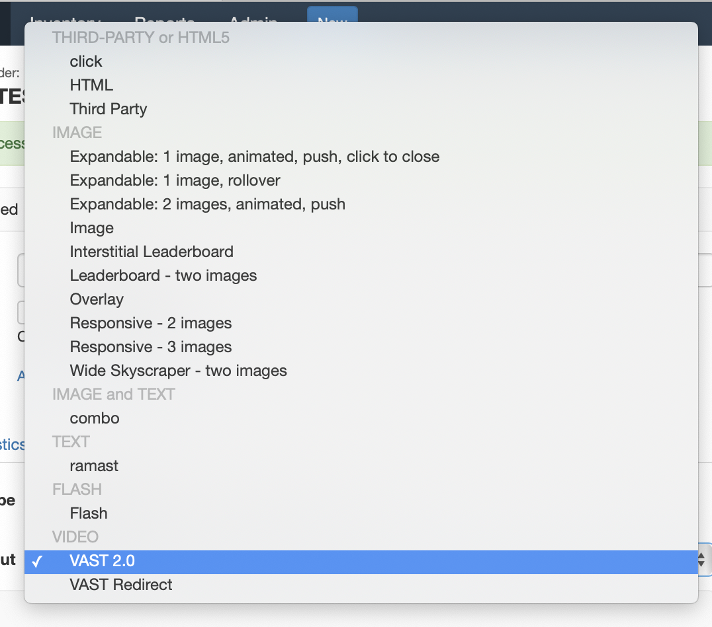
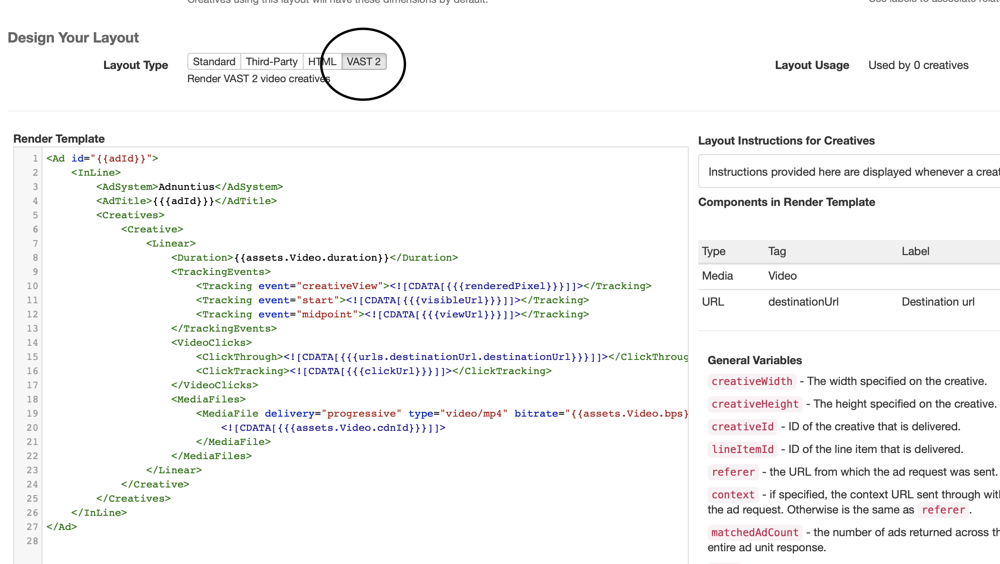
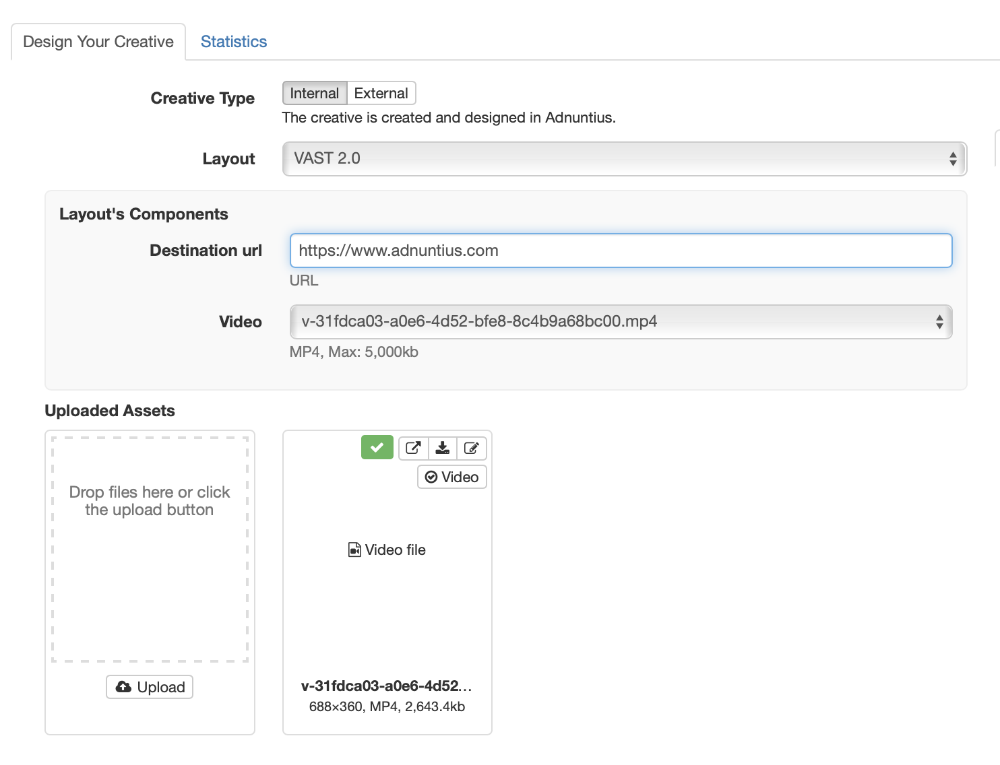

# VAST 2.0

In order to setup your ads correctly you will have to add a Line item with a Creative that uses a *Video* layout.



If there are no existing Video Layouts, then you will need to first generate one. If you create a new blank layout, and select VAST 2 as the Layout Type, then an appropriate layout render template will be generated for you.



Once you have selected a valid VAST layout for your creative, you will have to upload a video file and provide a click destination.




Make sure to target the creative or line item to the correct ad unit that can handle the vast format. In order to render the information in a correct way, you will have to use HTTP delivery that looks like this:

```http
https://delivery.adnuntius.com/i?auId=0000000000000000&tt=vast2
```

The important thing above is the `&tt=vast2` at the end, since it tells the delivery how it will render the information. The example above is the simplest version of HTTP delivery for ads. More parameters about user and targeting can be added as well.

