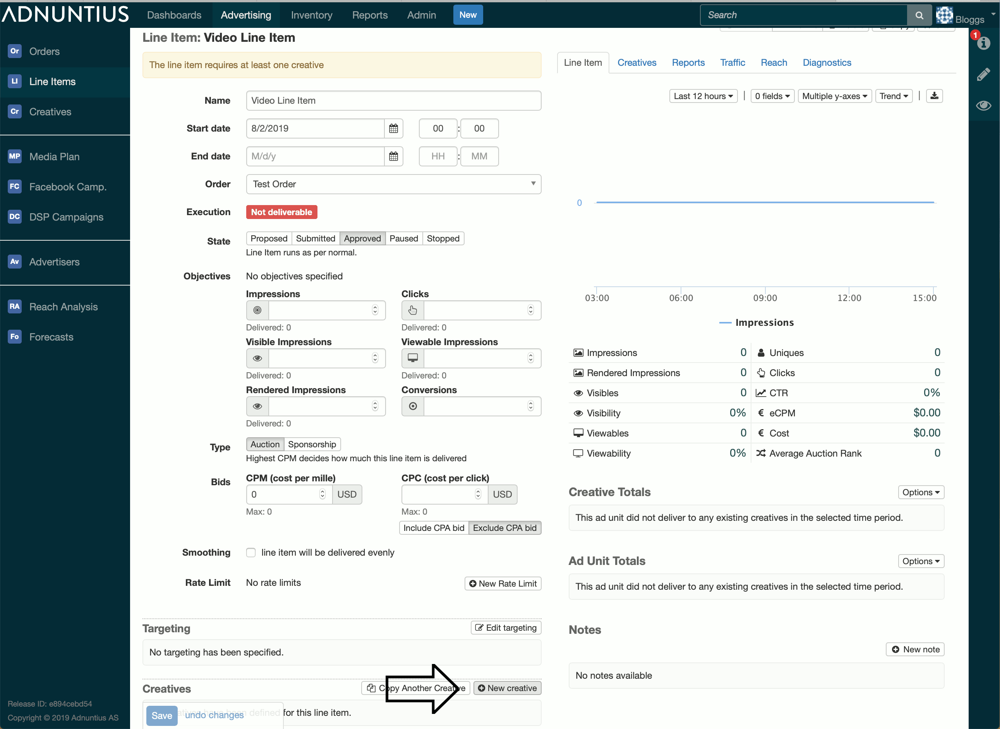
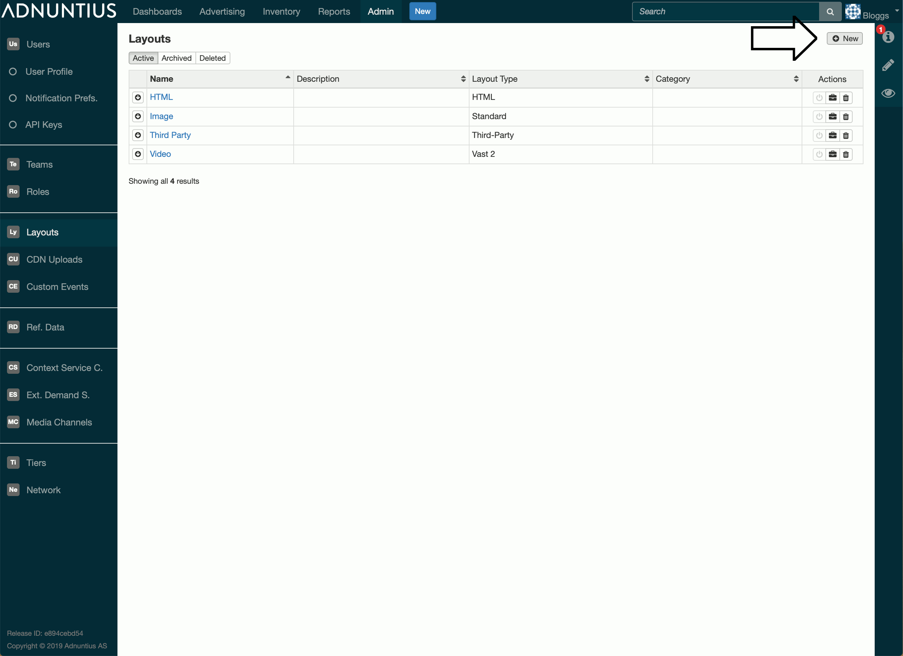

# VAST 2.0

You create a VAST video advertisement in Adnuntius by creating a Line Item with a Creative that uses a _Video_ Layout.



Note: if there are no existing Video Layouts, then you will first need to generate one. You create a new layout, select VAST 2 as the Layout Type, and then an appropriate render template will be automatically generated for you.



Make sure to target the creative or line item to the correct ad unit that can handle the vast format. In order to render the information in a correct way, you will have to use HTTP delivery that looks like this:

```http
https://delivery.adnuntius.com/i?auId=0000000000000000&tt=vast2
```

The important thing above is the `&tt=vast2` at the end, since it tells the delivery how it will render the information. The example above is the simplest version of HTTP delivery for ads. More parameters about user and targeting can be added as well.

