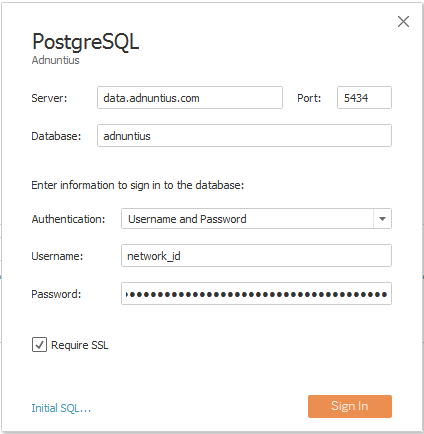
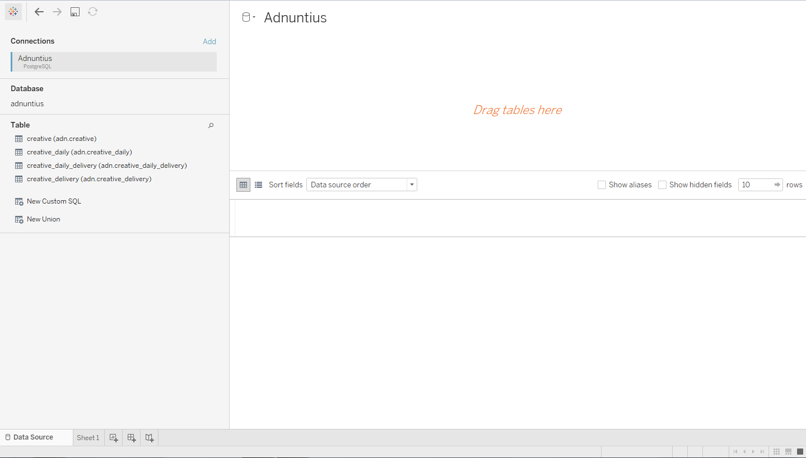
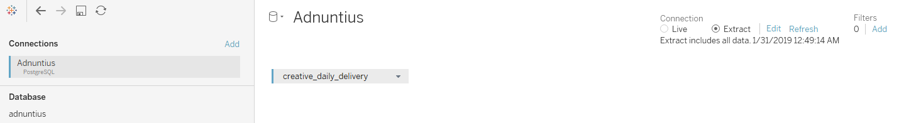

# Connecting Tableau to Adnuntius

Tableau (https://www.tableau.com/) is a paid, data visualisation platform that is used to provide business intelligence and analytics.  If you are interested in obtaining a license for Tableau to use with Adnuntius data, please contact support as we may be of assistance.

 This guide assumes a working knowledge of Tableau, Tableau Server, Data Sources, Extracts and the relationships between them. It is recommended to follow the Tableau tutorials to familiarise yourself first with the tool before attempting to follow this guide. 

## Before you start
In order to connect Tableau to Adnuntius, you will need the following:
* A installed copy of Tableau Desktop 2018.3 \(different versions _may_ work but are not supported\)
* **Either** an accessible installation of Tableau Server 2018.3 **or** a subscription to Tableau Online. Hosting a Tableau Server on your local network allows data to be fetched once from Adnuntius and then shared between several users with almost zero latency, leading to an
* A valid, current Adnuntius API Key \(Go to: **Admin -> API Keys -> Add API Key**\) with _Stats Querying_ scope.

## Adnuntius Data Source
Inside Tableau Desktop, create a new server connection of type _PostgreSQL_. Fill in the fields as follows:

 

| Field  | Value |
| :--- | :--- |
| Server | `data.adnuntius.com` |
| Port | `5434` |
| Database | adnuntius |
| Authentication | Username and Password |
| Username | Your `network_id` \(Go to: **Admin -> Network** to see your `network_id`\) |
| Password | API Key with _Stats Querying_ scope |
| Require SSL | True

## Accessing data
Once connected, the Adnuntius data source should look something like this:

 

The following tables are available:
* `creative` containing half-hour resolution data for just creatives up to 45 days old.
* `creative_daily` containing daily resolution data for just creatives for all time.
* `creative_delivery` containing half-hour resolution data for creatives and the ad units they delivered on, up to 45 days old.
* `creative_daily_delivery` containing daily resolution data for creatives and the ad units they delivered on for all time.

To begin using data, drag one of the tables from the left pane to the main working area.
 The Adnuntius data connection currently only supports accessing one table at a time. 

## Working with Adnuntius data
The Adnuntius data connection is designed to be used to create Tableau Extracts that are published to a Tableau server, which then allows the full features of Tableau to be used to analyze the data.

 The Adnuntius data connection is still under development and currently DOES NOT support any operations on live data \(filtering, grouping, conversion etc.\). Attempting to create visualisations on live data will results in errors within Tableau. 

### Creating an Extract
To create an extract on the selected table, switch the radio button on the top right to 'Extract' as shown.

 

When you move to a Worksheet \(ie. Sheet1 by default\) you may be prompted to save the Extract and then after Tableau extracts all the data, you will be taken to the Worksheet screen.

### Publishing the Extract
In order to most effectively use the Extract, using all the analytics features available to Tableau, it should be published to either a Tableau Server or Tableau Online.

From the top menu choose **Server -> Publish Data Source -> _Your data source_** and choose the location.  Once you have signed into to your Tableau Server or to Tableau Online, configure the settings as required, being sure to select 'Update workbook to use the published data source' and setting the authentication type to 'Embedded password' \(this will all Tableau Server or Tableau Online to automatically refresh the Extract\).

Different refresh schedules can be configured on Tableau Server or Tableau online directly, to allow the Extract to be refreshed once per day for example.

Once the Extract is published, other Tableau users can simply access it directly as a Data Source without going through the setup process described above \(ie. they do not need to enter Adnuntius server/port/API Key information and configure the Data Source).