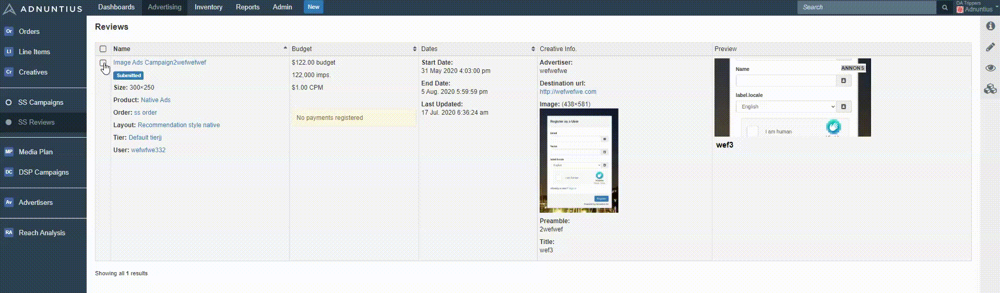
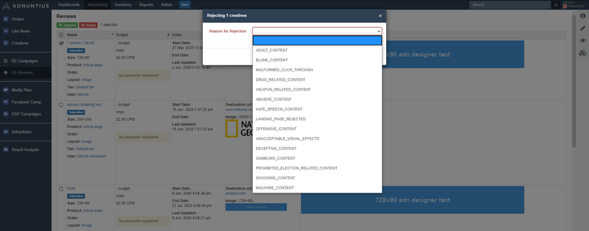
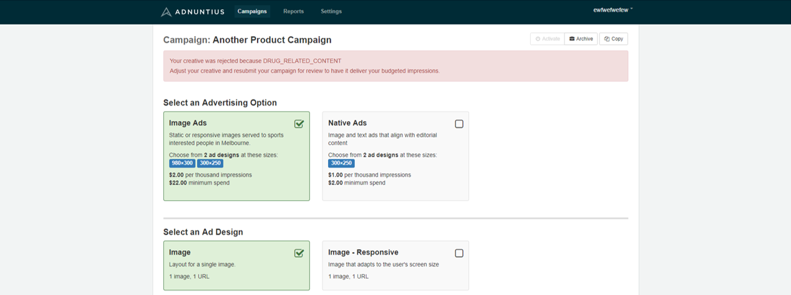
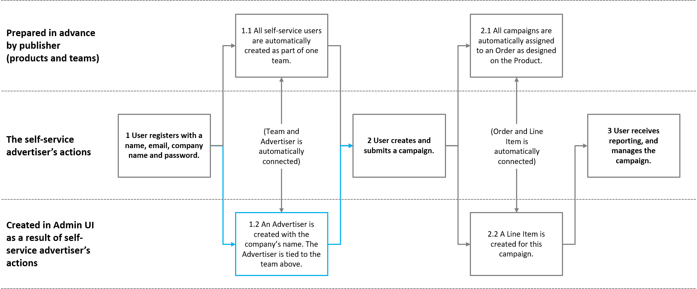
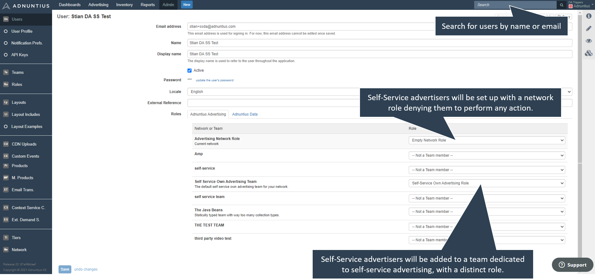
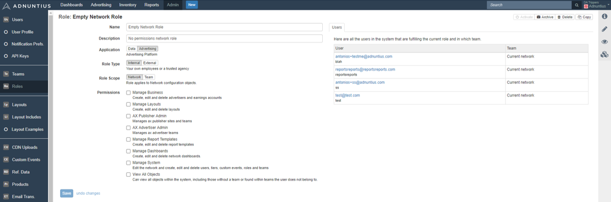
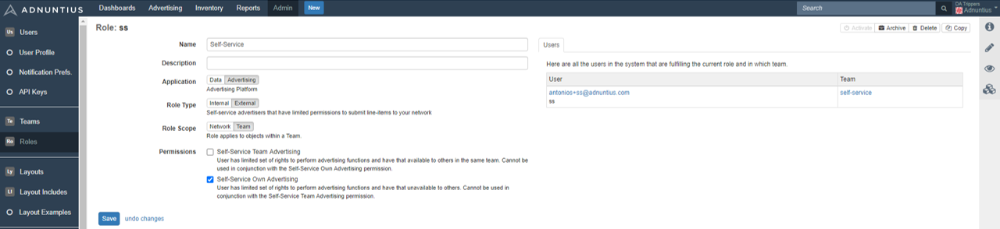

# Adnuntius Self-Service

This section assumes that you have an agreement with Adnuntius, and have been granted access to admin.adnuntius.com. If you are looking for an offer, please contact us at [support@adnuntius.com](mailto:support@adnuntius.com) and we will help you out. There are four main steps: 

1. Create your publishing inventory.
2. Make sure that ad requests are sent to your Adnuntius account.
3. Set up the self-service portal. 
4. Understand how it all works.

## Create Publishing Inventory

If you are already set up with Adnuntius Advertising and will not make any changes to your publishing inventory, you can skip this step.

<table>
  <thead>
    <tr>
      <th style="text-align:left">What and why</th>
      <th style="text-align:left">Choices</th>
    </tr>
  </thead>
  <tbody>
    <tr>
      <td style="text-align:left">1 Create an earnings account. Earnings accounts let you aggregate earnings
        that one or more sites have made, and is a tool to let you easily keep
        control of your earnings.</td>
      <td style="text-align:left">
        
<a href="https://admin.adnuntius.com/earnings-accounts">Start testing</a>
        

        
<a href="../../adnuntius-advertising/admin-ui/inventory/earnings-accounts.md">Documentation</a>
        

      </td>
    </tr>
    <tr>
      <td style="text-align:left">2 Create a site group. Site groups makes it easier to later target campaigns
        to groups of sites if you control many sites. If you only have one or a
        few sites you can skip this step.</td>
      <td style="text-align:left">
        
<a href="https://admin.adnuntius.com/site-groups">Start testing</a>
        

        
<a href="../../adnuntius-advertising/admin-ui/inventory/site-groups.md">Documentation</a>
        

      </td>
    </tr>
    <tr>
      <td style="text-align:left">3 Create a site. A site is a domain where you would like ads to go. We
        recommend that you start by creating one site so that you learn the process,
        and then you can create more later when you have worked through this list.</td>
      <td
      style="text-align:left">
        
<a href="https://admin.adnuntius.com/sites">Start testing</a>
        

        
<a href="../../adnuntius-advertising/admin-ui/inventory/sites.md">Documentation</a>
        

        </td>
    </tr>
    <tr>
      <td style="text-align:left">4 Create ad units. An ad unit is a placement that can be filled with ads
        later by self-service advertisers.</td>
      <td style="text-align:left">
        
<a href="https://admin.adnuntius.com/ad-units">Start testing</a>
        

        
<a href="../../adnuntius-advertising/admin-ui/inventory/adunits-1.md">Documentation</a>
        

      </td>
    </tr>
  </tbody>
</table>

## Ensure that Ad Requests are Sent to Adnuntius

If you are already set up with Adnuntius Advertising and will not make any changes to your publishing inventory, you can skip this step. [There are different ways of ensuring that ad requests are sent to Adnuntius, so that self-service advertisers can later buy this traffic.](../../adnuntius-advertising/requesting-ads/)

## Set Up the Self-Service Portal

<table>
  <thead>
    <tr>
      <th style="text-align:left">What to do</th>
      <th style="text-align:left">Actions</th>
    </tr>
  </thead>
  <tbody>
    <tr>
      <td style="text-align:left">1 The process starts with you sending us a bit of material (send to
        <a
        href="mailto:support@adnuntius.com">support@adnuntius.com</a>) so that we can get your portal up and running.
          Click on the link to the right to understand what to send us. While we
          get you set up you can proceed with the points below.</td>
      <td style="text-align:left"><a href="./#material-for-self-service-portal">Documentation</a>
      </td>
    </tr>
    <tr>
      <td style="text-align:left">2 Create products. Products package dimensions, pricing, layouts and targeting
        so that buying ads can be made simple. Whenever a self-service advertiser
        creates a campaign, choosing a product is the first step in creating that
        campaign.</td>
      <td style="text-align:left">
        
<a href="../../adnuntius-advertising/admin-ui/admin/products.md">Documentation</a>
        

        
<a href="https://admin.adnuntius.com/admin/products">Start</a>
        

      </td>
    </tr>
    <tr>
      <td style="text-align:left">3 Understand the user interface. When you have set up the portal you should
        get comfortable with the user interface by creating a test user, and to
        try booking a campaign. Also, you can refer to the documentation page we
        provide, or copy the text to your own domain to provide self-service advertisers
        with a user guide.</td>
      <td style="text-align:left"><a href="user-interface-guide.md">Documentation</a>
      </td>
    </tr>
    <tr>
      <td style="text-align:left">4 Learn the approval process. When a self-service advertiser has created
        a campaign, then you as a publisher need to approve its creatives. This
        ensures that creatives do not contain illegal or unethical content, or
        anything you don&apos;t like.</td>
      <td style="text-align:left">
        
<a href="./#approval-process">Documentation</a>
        

        
<a href="https://admin.adnuntius.com/line-items">Start</a>
        

      </td>
    </tr>
    <tr>
      <td style="text-align:left">5 Personalize emails being sent to new users, and to those who have forgotten
        their passwords. You can create multiple translations and target the emails
        to countries of each language.</td>
      <td style="text-align:left">
        
<a href="../../adnuntius-advertising/admin-ui/admin/email-translations.md">Documentation</a>
        

        
<a href="https://admin.adnuntius.com/admin/email-translations">Start</a>
        

      </td>
    </tr>
    <tr>
      <td style="text-align:left">6 Understand the workflow, and how users, orders, teams and advertisers
        are used and created once a self-service advertiser chooses to create an
        account.</td>
      <td style="text-align:left"><a href="./#understanding-the-workflow">Documentation</a>
      </td>
    </tr>
    <tr>
      <td style="text-align:left">7 Understand user management. While Adnuntius will be set up with the
        correct roles as part of the onboarding process, understanding how to manage
        users is an important part of providing good customer service.</td>
      <td
      style="text-align:left">
        
<a href="./#user-management">Documentation</a>
        

        
<a href="https://admin.adnuntius.com/admin/users">Start</a>
        

        </td>
    </tr>
  </tbody>
</table>

## Material for Self-Service Portal

In order to get your portal set up we need some information from you. Please send the below to [support@adnuntius.com](mailto:support@adnuntius.com). 

<table>
  <thead>
    <tr>
      <th style="text-align:left">Material needed and explanations</th>
      <th style="text-align:left">Examples and requirements</th>
    </tr>
  </thead>
  <tbody>
    <tr>
      <td style="text-align:left">A &quot;domain name&quot;. Your self-service portal will be placed under
        a URL such as the example on the left, so please send us your preferred
        name.</td>
      <td style="text-align:left">
        
https://bookings.adnuntius.com/yourname/

        
or bookings.yourdomain.com

      </td>
    </tr>
    <tr>
      <td style="text-align:left">A background image and text for the login page. The image lets you create
        your own look, while the text to the left of the login box lets you communicate
        your channel to the advertiser in short. See example below (the image with
        boats in the background).</td>
      <td style="text-align:left">Requirements: 1920x1080px, max 500kb</td>
    </tr>
    <tr>
      <td style="text-align:left">Content for an optional FAQ page. In settings self-service advertisers
        will be able to access a FAQ page in order to get answers to questions.
        You can use the information we have provided in the user interface guide,
        or provide your own.</td>
      <td style="text-align:left">User interface guide: <a href="https://docs.adnuntius.com/onboarding-guides/adnuntius-self-service/user-interface-guide">https://docs.adnuntius.com/onboarding-guides/adnuntius-self-service/user-interface-guide</a>
      </td>
    </tr>
    <tr>
      <td style="text-align:left">A top menu logo. Logged in users will have your logo in the top menu bar.
        An example image is provided below.</td>
      <td style="text-align:left">Requirements: max 200x40px, max 150kb, transparent background</td>
    </tr>
    <tr>
      <td style="text-align:left">Optional customer support contact (if you will provide customer support)
        in the form of an email address.</td>
      <td style="text-align:left">Example: support@yourdomain.com</td>
    </tr>
    <tr>
      <td style="text-align:left">Favicon (browser tab icon).</td>
      <td style="text-align:left">Requirements: 16x16px, PNG, GIF or JPG, transparent background</td>
    </tr>
    <tr>
      <td style="text-align:left">Optional styling schema (unless you want to use our default), showing
        the styling on certain elements. Please deliver the filled out styling
        schema to <a href="mailto:support@adnuntius.com">support@adnuntius.com</a>.</td>
      <td
      style="text-align:left">
        
<a href="https://docs.google.com/spreadsheets/d/1FQ43t3kqx_r755ujKq6iiavy_MY72Hnvv_wfOkiNhzs/edit?usp=sharing">Styling schema to fill out</a>
        

        
<a href="https://drive.google.com/file/d/1EH4l5KfZfTvrx-KLzb9L112Np6xHcl08/view?usp=sharing">Guide to styling schema</a>
        

        </td>
    </tr>
    <tr>
      <td style="text-align:left">Registration information. When a user decides to create an account they
        will always be asked for their name, email and location. But we can also
        collect information such as company name and VAT number. Please let us
        know what information should be collected about an advertiser, and what
        should be mandatory and optional.</td>
      <td style="text-align:left">
        
Example:

        <ul>
          <li>Company name (mandatory)</li>
          <li>VAT number (optional)</li>
          <li>Address (mandatory)</li>
        </ul>
      </td>
    </tr>
  </tbody>
</table>

## Approval Process

Once a self-service advertiser has created and submitted a campaign you will need to approve the creative material before the campaign goes live. Go to [https://admin.adnuntius.com/reviews](https://admin.adnuntius.com/reviews) and to see all creatives pending review. If you approve a creative then the advertiser's campaign will go live immediately, and the advertiser will be notified about the decision.

If you click to reject a creative then you can choose a reason why this creative was rejected. The screenshot below shows you the range of reasons for rejection that you can apply. Once you have selected a reason then the advertiser will be notified of your decision, and they will also see the reason for rejection so that they can make the appropriate changes.

## Understanding the Workflow

This section explains how objects like users, advertisers, teams, campaigns and more are created when a self-service advertisers choose to join and to create campaigns. This helps you understand how to find various objects in admin.adnuntius.com when it is needed. As the image below illustrates there are three types of objects \(see the left-most side of the image below\) you should know about. 

* Certain objects are prepared in advance by you as a publisher. These include products and teams. 
* When a self-service advertiser chooses to sign up, they will create a user access, after which they can also create campaigns. 
* When self-service advertisers create the items above, you as a publisher will find these in admin.adnuntius.com.

| Steps and explanations | Resources |
| :--- | :--- |
| **1 Self-service advertiser registers** with a name, email, company name \(you can choose if company name is needed\) and password. This is the one time job that each user has to go through in order to create user access.  | [Example registration page](https://assets.adnuntius.com/xOVX5p4fQbjhI8Nz6_iBU34re-unkwsad633WKXeV4s.png) |
| 1.1 All self-service users are automatically created as part of one team. As part of the implementation process we will set up a team for you. All users registering as self-service advertisers will automatically become part of this team. | [See how this is organized](./#user-management) |
| 1.2 An Advertiser is automatically created with the company’s name. The Advertiser is automatically tied to the team above. Please note that we do not require this step; if you are allowed to, and want to, allow private persons to create ads then you can do so.  | [How Advertisers are stored](../../adnuntius-advertising/admin-ui/advertising/advertisers.md) |
| **2 Self-service advertiser creates and submits a campaign.** This involves choosing a product, design \(layout\) and targeting made avaiable by you through one or more products, applying a budget, and paying for the campaign \(if you want advertisers to prepay\).  | [More about products](../../adnuntius-advertising/admin-ui/admin/products.md) |
| 2.1 All campaigns are automatically assigned to one Order as designed on the Product. As a publisher you can visit and manage this order.  |  |
| 2.2 A Line Item is created for this campaign. As a publisher you can make any changes to each line item, such as changing targeting or creatives. |  |
| **3 Self-service advertiser receives reporting, and manages the campaign.** Campaigns are now running and registering reporting. |  |

## User Management

A self-service advertiser will be able to register on their own through your self-service portal. However, they will not be able to log into admin.adnuntius.com, as this is an admin area for you alone. Once they have created a user however, you will be able to see and manage that user in admin.adnuntius.com. Here are the actions you can do to a user once it is created. 

* Search for users by their name or email address in the upper right corner, or you can browse through users under [https://admin.adnuntius.com/admin/users](https://admin.adnuntius.com/admin/users).
* Change the email address and name of the user. Changing the email means that the self-service advertiser will need to log in with the new email address, and this change is not automatically communicated through automated emails.
* Update the user's password. Please note that if you update the user's password from within the admin user interface, that user will not be notified about changed passwords. If they should be notified, you should tell the user to click the "forgot your password" link from your portal's login page. 
* Activate or de-activate the user. If you de-activate the user, then that user can no longer log in.
* Change the user's locale. Whenever users register they will be able to set their location, and this may determine the language of emails and the user interface. If they for any reason have set the wrong locale you can manually change it here. 
* You can also change their roles and teams, but this is not recommended as this may give users access to parts of the systems that they should not have.

**More about roles**. When a self-service advertiser registers they will automatically be set up with a network role and a team role. The network role will be an empy network role, while the team role will contain the "Self-Service Own Advertising" rights. To understand users, roles and team in detail, please see [here](../../adnuntius-advertising/admin-ui/admin/users-teams-and-roles.md).

