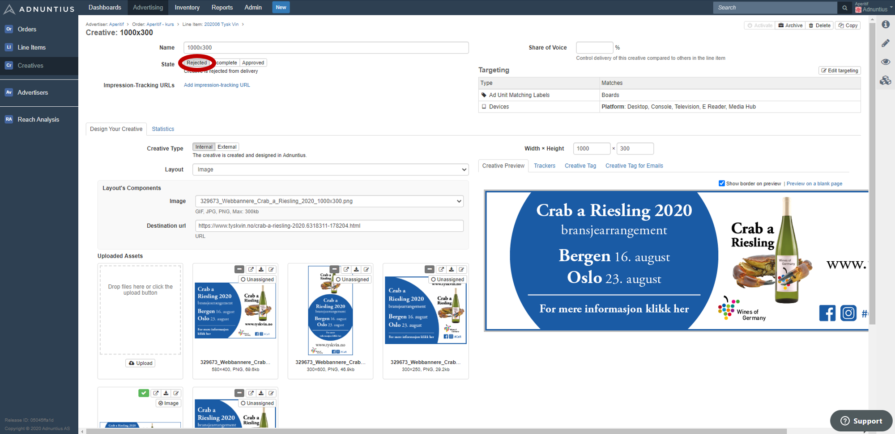

# Self-Service \(Work in Progress\)

This section assumes that you are set up so that ads are being requested from Adnuntius using [javascript tags](../../adnuntius-advertising/requesting-ads/intro/), prebid, openrtb or [API integration](../../adnuntius-advertising/requesting-ads/http-api.md). If you still need help with this, please contact us at [support@adnuntius.com](mailto:support@adnuntius.com). Also, if you don't have access to self-service advertising, please contact us at [support@adnuntius.com](mailto:support@adnuntius.com) and we will help you get started. 

<table>
  <thead>
    <tr>
      <th style="text-align:left">What to do</th>
      <th style="text-align:left">Actions</th>
    </tr>
  </thead>
  <tbody>
    <tr>
      <td style="text-align:left">1 Get your portal up and running. We will guide you through a process
        of setting up the self-service portal and tools, involving branding and
        more. We will reach out to you to get started, but if you for any reason
        need to get a hold of us, you can do so through support.</td>
      <td style="text-align:left"><a href="mailto:support@adnuntius.com">Contact support</a>
      </td>
    </tr>
    <tr>
      <td style="text-align:left">2 Create products. Products package dimensions, pricing, layouts and targeting
        so that buying ads can be made simple. Whenever a self-service advertiser
        creates a campaign, choosing a product is the first step in creating that
        campaign.</td>
      <td style="text-align:left">
        
<a href="../../adnuntius-advertising/admin-ui/admin/products.md">Documentation</a>
        

        
<a href="https://admin.adnuntius.com/admin/products">Start</a>
        

      </td>
    </tr>
    <tr>
      <td style="text-align:left">3 Understand the user interface. When you have set up the portal you should
        get comfortable with the user interface by creating a test user, and to
        try booking a campaign. Also, you can refer to the documentation page we
        provide, or copy the text to your own domain to provide self-service advertisers
        with a user guide.</td>
      <td style="text-align:left"><a href="user-interface-guide.md">Documentation</a>
      </td>
    </tr>
    <tr>
      <td style="text-align:left">4 Learn the approval process. When a self-service advertiser has created
        a campaign, then you as a publisher need to approve its creatives. This
        ensures that creatives do not contain illegal or unethical content, or
        anything you don&apos;t like.</td>
      <td style="text-align:left">
        
<a href="https://docs.adnuntius.com/onboarding-guides/adnuntius-self-service#approval-process">Documentation</a>
        

        
<a href="https://admin.adnuntius.com/line-items">Start</a>
        

      </td>
    </tr>
    <tr>
      <td style="text-align:left">5 Personalize emails being sent to new users, and to those who have forgotten
        their passwords. You can create multiple translations and target the emails
        to countries of each language.</td>
      <td style="text-align:left">
        
<a href="../../adnuntius-advertising/admin-ui/admin/email-translations.md">Documentation</a>
        

        
<a href="https://admin.adnuntius.com/admin/email-translations">Start</a>
        

      </td>
    </tr>
    <tr>
      <td style="text-align:left">6 Understand user management. While Adnuntius will be set up with the
        correct roles as part of the onboarding process, understanding how to manage
        users is an important part of providing good customer service.</td>
      <td
      style="text-align:left">
        
Documentation

        
<a href="https://admin.adnuntius.com/admin/users">Start</a>
        

        </td>
    </tr>
  </tbody>
</table>

## Approval Process

Once a self-service advertiser has created and submitted a campaign you will need to approve the creative material before the campaign goes live. Here is how you do it.

Go to [https://admin.adnuntius.com/line-items](https://admin.adnuntius.com/line-items) and apply the filter "submitted" in the menu above the list of line items. You will now see a list of creatives that are up for review and approval. Click to preview the creative, and if it looks ok set its status to approved. It will now start delivering impressions. 

If a creative should be rejected for any reason, go to that creative specifically and apply "rejected" as status. The self-service advertiser will then get notified about this decision, so that they can make approvements and try again. 

## User Management

sdf

