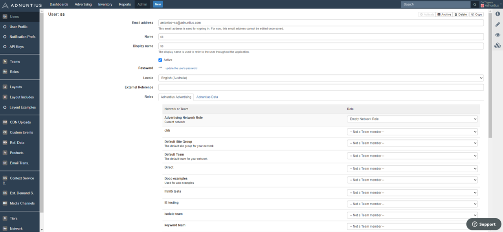

# Self-Service \(Work in Progress\)

This section assumes that you have an agreement with Adnuntius, and have been granted access to admin.adnuntius.com. If you are looking for an offer, please contact us at [support@adnuntius.com](mailto:support@adnuntius.com) and we will help you out. There are three main steps: 

1. Create your publishing inventory.
2. Make sure that ad requests are sent to your Adnuntius account.
3. Set up the self-service portal. 

## Create Publishing Inventory

If you are already set up with Adnuntius Advertising and will not make any changes to your publishing inventory, you can skip this step.

<table>
  <thead>
    <tr>
      <th style="text-align:left">What and why</th>
      <th style="text-align:left">Choices</th>
    </tr>
  </thead>
  <tbody>
    <tr>
      <td style="text-align:left">1 Create an earnings account. Earnings accounts let you aggregate earnings
        that one or more sites have made, and is a tool to let you easily keep
        control of your earnings.</td>
      <td style="text-align:left">
        
<a href="https://admin.adnuntius.com/earnings-accounts">Start testing</a>
        

        
<a href="../../adnuntius-advertising/admin-ui/inventory/earnings-accounts.md">Documentation</a>
        

      </td>
    </tr>
    <tr>
      <td style="text-align:left">2 Create a site group. Site groups makes it easier to later target campaigns
        to groups of sites if you control many sites. If you only have one or a
        few sites you can skip this step.</td>
      <td style="text-align:left">
        
<a href="https://admin.adnuntius.com/site-groups">Start testing</a>
        

        
<a href="../../adnuntius-advertising/admin-ui/inventory/site-groups.md">Documentation</a>
        

      </td>
    </tr>
    <tr>
      <td style="text-align:left">3 Create a site. A site is a domain where you would like ads to go. We
        recommend that you start by creating one site so that you learn the process,
        and then you can create more later when you have worked through this list.</td>
      <td
      style="text-align:left">
        
<a href="https://admin.adnuntius.com/sites">Start testing</a>
        

        
<a href="../../adnuntius-advertising/admin-ui/inventory/sites.md">Documentation</a>
        

        </td>
    </tr>
    <tr>
      <td style="text-align:left">4 Create or rename your team. You already have a team created, but you
        can now rename it to your liking, and/or create more teams that control
        who should have access to what content.</td>
      <td style="text-align:left">
        
<a href="https://admin.adnuntius.com/admin/teams">Start testing</a>
        

        
<a href="../../adnuntius-advertising/admin-ui/admin/users-teams-and-roles.md">Documentation</a>
        

      </td>
    </tr>
    <tr>
      <td style="text-align:left">5 Create an ad unit. An ad unit is a placement that can be filled with
        ads later by self-service advertisers.</td>
      <td style="text-align:left">
        
<a href="https://admin.adnuntius.com/ad-units">Start testing</a>
        

        
<a href="../../adnuntius-advertising/admin-ui/inventory/adunits-1.md">Documentation</a>
        

      </td>
    </tr>
  </tbody>
</table>

## Ensure that Ad Requests are Sent to Adnuntius

If you are already set up with Adnuntius Advertising and will not make any changes to your publishing inventory, you can skip this step. There are different ways of ensuring that ad requests are sent to Adnuntius, so that self-service advertisers can later buy this traffic.

<table>
  <thead>
    <tr>
      <th style="text-align:left">Connection method</th>
      <th style="text-align:left">How to</th>
    </tr>
  </thead>
  <tbody>
    <tr>
      <td style="text-align:left">Javascript tags</td>
      <td style="text-align:left"><a href="../../adnuntius-advertising/requesting-ads/intro/">Documentation</a>
      </td>
    </tr>
    <tr>
      <td style="text-align:left">Prebid</td>
      <td style="text-align:left">
        
<a href="../../other-useful-information/header-bidding-implementation.md">Documentation</a>
        

        
<a href="http://prebid.org/dev-docs/bidders.html#adnuntius">Prebid.org documentation</a>
        

      </td>
    </tr>
    <tr>
      <td style="text-align:left">HTTP API</td>
      <td style="text-align:left"><a href="../../adnuntius-advertising/requesting-ads/http-api.md">Documentation</a>
      </td>
    </tr>
    <tr>
      <td style="text-align:left">OpenRTB</td>
      <td style="text-align:left"><a href="../../adnuntius-advertising/requesting-ads/open-rtb.md">Documentation</a>
      </td>
    </tr>
  </tbody>
</table>

## Set Up the Self-Service Portal

<table>
  <thead>
    <tr>
      <th style="text-align:left">What to do</th>
      <th style="text-align:left">Actions</th>
    </tr>
  </thead>
  <tbody>
    <tr>
      <td style="text-align:left">1 Get your portal up and running. We will guide you through a process
        of setting up the self-service portal and tools, involving branding and
        more. We will reach out to you to get started, but if you for any reason
        need to get a hold of us, you can do so through support.</td>
      <td style="text-align:left"><a href="mailto:support@adnuntius.com">Contact support</a>
      </td>
    </tr>
    <tr>
      <td style="text-align:left">2 Create products. Products package dimensions, pricing, layouts and targeting
        so that buying ads can be made simple. Whenever a self-service advertiser
        creates a campaign, choosing a product is the first step in creating that
        campaign.</td>
      <td style="text-align:left">
        
<a href="../../adnuntius-advertising/admin-ui/admin/products.md">Documentation</a>
        

        
<a href="https://admin.adnuntius.com/admin/products">Start</a>
        

      </td>
    </tr>
    <tr>
      <td style="text-align:left">3 Understand the user interface. When you have set up the portal you should
        get comfortable with the user interface by creating a test user, and to
        try booking a campaign. Also, you can refer to the documentation page we
        provide, or copy the text to your own domain to provide self-service advertisers
        with a user guide.</td>
      <td style="text-align:left"><a href="user-interface-guide.md">Documentation</a>
      </td>
    </tr>
    <tr>
      <td style="text-align:left">4 Learn the approval process. When a self-service advertiser has created
        a campaign, then you as a publisher need to approve its creatives. This
        ensures that creatives do not contain illegal or unethical content, or
        anything you don&apos;t like.</td>
      <td style="text-align:left">
        
<a href="https://docs.adnuntius.com/onboarding-guides/adnuntius-self-service#approval-process">Documentation</a>
        

        
<a href="https://admin.adnuntius.com/line-items">Start</a>
        

      </td>
    </tr>
    <tr>
      <td style="text-align:left">5 Personalize emails being sent to new users, and to those who have forgotten
        their passwords. You can create multiple translations and target the emails
        to countries of each language.</td>
      <td style="text-align:left">
        
<a href="../../adnuntius-advertising/admin-ui/admin/email-translations.md">Documentation</a>
        

        
<a href="https://admin.adnuntius.com/admin/email-translations">Start</a>
        

      </td>
    </tr>
    <tr>
      <td style="text-align:left">6 Understand user management. While Adnuntius will be set up with the
        correct roles as part of the onboarding process, understanding how to manage
        users is an important part of providing good customer service.</td>
      <td
      style="text-align:left">
        
<a href="https://docs.adnuntius.com/onboarding-guides/adnuntius-self-service#user-management">Documentation</a>
        

        
<a href="https://admin.adnuntius.com/admin/users">Start</a>
        

        </td>
    </tr>
  </tbody>
</table>

## Approval Process

Once a self-service advertiser has created and submitted a campaign you will need to approve the creative material before the campaign goes live. Here is how you do it.

Go to [https://admin.adnuntius.com/line-items](https://admin.adnuntius.com/line-items) and apply the filter "submitted" in the menu above the list of line items. You will now see a list of creatives that are up for review and approval. Click to preview the creative, and if it looks ok set its status to approved. It will now start delivering impressions. 

If a creative should be rejected for any reason, go to that creative specifically and apply "rejected" as status. The self-service advertiser will then get notified about this decision, so that they can make approvements and try again. 

## User Management

A self-service advertiser will be able to register on their own when visiting your portal. Once they have created and activated a user for themselves you should understand how you can manage this user in the event that any changes or support is needed. 

**Roles**. When a self-service advertiser registers they will be set up with a network role and a team role. The network role will be an empy network role, so that the user cannot perform any actions to your network. The team role will contain the "Self-Service Own Advertising" rights. To understand users, roles and team in better detail, please see [here](../../adnuntius-advertising/admin-ui/admin/users-teams-and-roles.md).

Users. To see all users registered with your network, go to [https://admin.adnuntius.com/admin/users](https://admin.adnuntius.com/admin/users). When you click on a user you will be able to perform a set of actions for that user \(see example user below\). 

* Change email address and name of the user. The display name is just the name that is displayed in the user interface. 
* Activate or de-activate the user. If you de-activate the user, then that user can no longer log in.
* Update the user's password. Please note that if you update the user's password from within the admin user interface, that user will not be notified about changed passwords. If they should be notified, please tell the user to click the "forgot your password" link from your portal's login page. 
* Change the user's locale. Whenever users register they will be able to set their location, and this may determine the language of emails and the user interface. If they for any reason have set the wrong locale you can manually change it here. 
* You can also change their roles and teams, but this is not recommended as this may give users access to parts of the systems that they should not have. 

