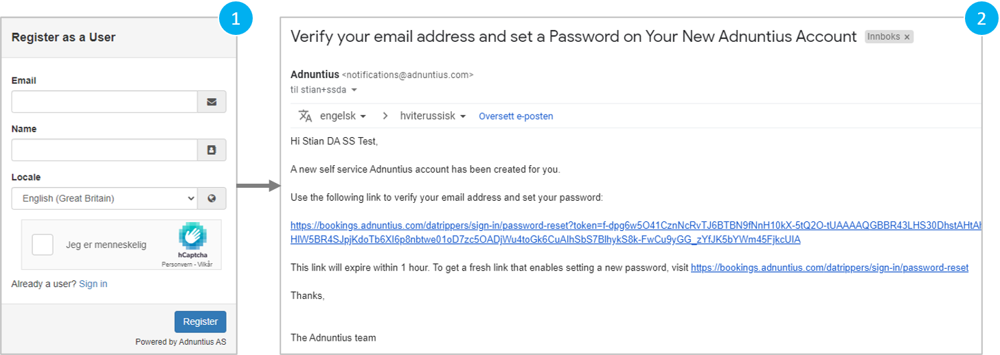

# User Interface Guide

## Registering and logging in

Registering has an advertiser is easy and free. First go to https://bookings.adnuntius.com/\[network-name\] \(where the network name is the name the publisher applies for its booking portal\). 

1. Register with your email, name and location, and verify that you are a human. 
2. Get a confirmation that we have sent you an email.
3. Go to your email inbox and click the link so that you can verify your email adress, create a password, and activate the account. 

When you later need to log in, just enter your email address and password. If you forget your password you can at any time reset your password.

## Creating a Campaign

Once you are logged in you will see the campaigns overview page, where you will later see all live, pending and finished campaigns. [Skip to learn more about the campaign overview](https://docs.adnuntius.com/onboarding-guides/adnuntius-self-service/user-interface-guide#campaign-overview). 

## Campaign Overview

To be completed.

## Ongoing Campaign Details

To be completed.

