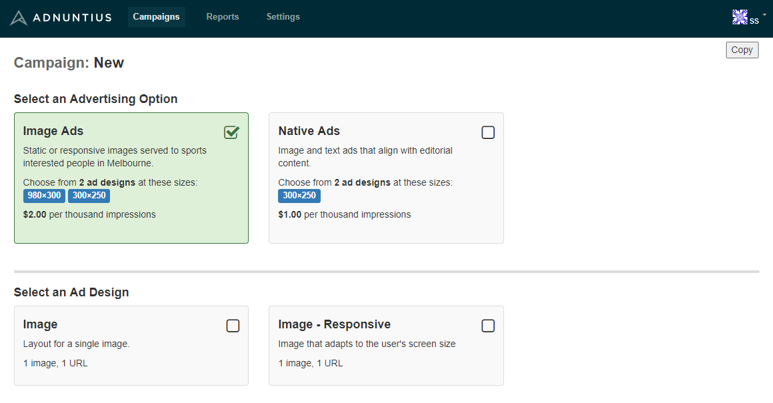
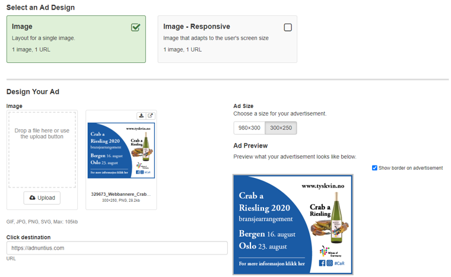
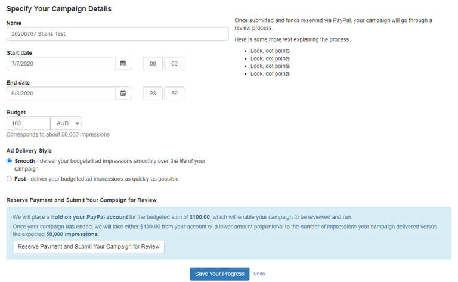
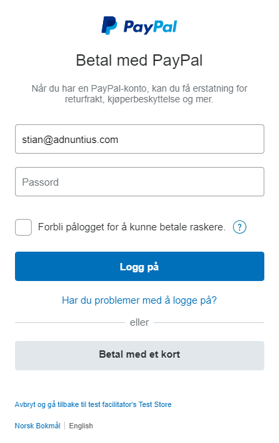
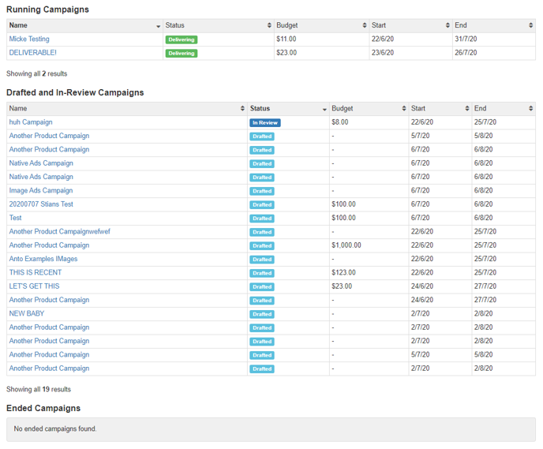
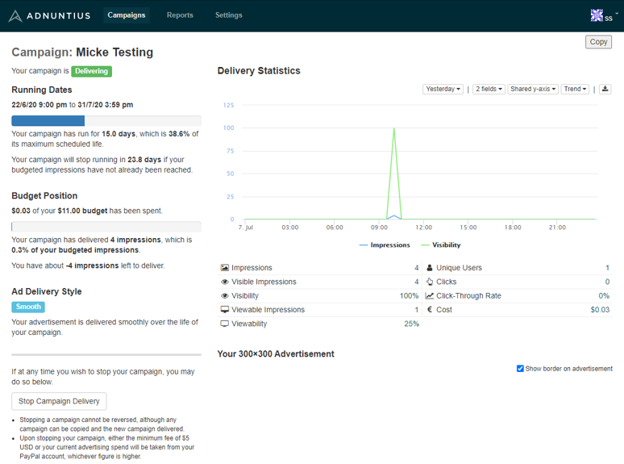

# User Interface Guide

## Registering and logging in

Registering has an advertiser is easy and free. Go to the self-service portal and click to register as a new user. Fill in the information required, then click to register. You will now get a confirmation email \(make sure that you check your spam folder if you don't receive one\). Click the link in the email to verify your email address, apply a password and you are registered. 

When you later need to log in, just enter your email address and password. If you forget your password you can at any time reset your password.

## Creating a Campaign

Once you are logged in you will see the campaigns overview page, where you will later see all live, pending and finished campaigns. [Skip to learn more about the campaign overview](https://docs.adnuntius.com/onboarding-guides/adnuntius-self-service/user-interface-guide#campaign-overview). Here is how you create a campaign. First, click "New campaign".

**Select an Advertising Option**. Advertising options can vary depending on who you buy campaigns from. An advertising option can as such be considered as a "product" where your provider makes available certain sizes, formats and targeting criteria available for buying. An advertising option will in all cases include the following: 

* A name and optional description, to explain the options you can choose. 
* Available sizes \(width x height\) for each option, so that you can see how big the ads will be. 
* Available ad designs \(see below\). 
* Any preset targeting \(optional\) to ensure that you reach the right users in the right context.

Below is an example where two advertising options are made available.

**Select an ad design**. Above are two alternative ad designs made available by an advertising option. Once you have chosen an advertising option, you next choose the ad design that you want to buy. As is the case with advertising options, ad designs vary depending on who you buy campaigns from. Regardless of what you choose though, ad designs will determine the look and feel of your advertisement, and what information the ad should contain. 

**Design your ad.** Once you have chosen an ad design you can upload material and add details. Depending on the design you have chosen you will be asked to provide things such as images, click URLs \(where the user should land if he/she clicks on the ad\), and other information such as text fields if you are buying formats like for instance native ads. 

**Specify campaign details**. Apply the following: 

* A name of your choice so that you easily find your campaign after you've saved it. 
* A start and end date. You can leave the end date blank if you want your campaign to run until the budget is spent. 
* A total budget for the campaign.
* Ad delivery style; choose between having impressions delivered evenly over the life of your campaign, and having impressions delivered as fast as possible. 

**Pay for your campaign**. We will place a hold on your PayPal account for the budget you applied, which will enable your campaign to be reviewed and run. Once your campaign has ended, we will take the budgeted amount from your account, or if the campaign for some reason didn't deliver all its traffic, a lower amount proportional to the number of impressions your campaign delivered versus the expected impressions.

We use Paypal as the payment service provider in order to provide you with a reliable and safe payment method. You can choose to pay using your Paypal account or a credit card. 

**Get your campaign approved**. Once you have paid for the campaign, it will be reviewed by support personnel to ensure that everything looks ok. If something is missing or doesn't look right you will receive an email telling you to correct your campaign.

## Campaign Overview

The campaign overview is divided into three parts; Running Campaigns, Drafted and In-Review Campaigns, and Ended Campaigns.

* Running campaigns are campaigns that are currently active and delivering impressions. 
* Drafted campaigns are campaigns you've started creating, but not finished yet so that they can be reviewed and set live. 
* In-review campaigns are campaigns that you have completed, and that are currently being reviewed to ensure that everything looks ok. 
* Ended campaigns are campaigns that have delivered on their budget, and/or passed their end dates. 

## Campaign Details

In the campaign overview you can click on any of the campaigns to view its details. The details will give you a range of information.

* Running dates to tell you how long your campaign has been running, and how much is left. 
* Budget position telling you how much is spent so far and how much is left. 
* Ad delivery style telling you if the ad is being delivered evenly across the campaign period, or delivered as fast as possible. 
* Delivery statistics telling you how the campaign delivers on impressions, clicks, unique users, visibles and viewables. 

Please also note that you can choose the campaign period you're looking at, how you want statistics to be shown, and also choose to download the campaign statistics to an Excel file.

You can also choose to stop the campaign, in which case we will charge you for what you have spent so far, or a minimum fee of USD 5 \(whatever is highest\) so that we can cover payment fees. 

