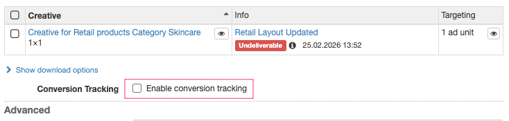

# Adding attribution to product ads

First you will have to enable attribution for your network. If you are an admin you can do this by adding a set of custom events for when you wish an attribution should be recorded. This can be found in the _**admin -> custom events**_ -section.

<figure><figcaption></figcaption></figure>

Once created these events will triggered as long as you have activated "conversion tracking" on a product. That can be done on a line item located under the list of creatives. This will ensure that when a product is delivered we will write attribution information into the Adnuntius cookie.

<figure><figcaption></figcaption></figure>

After this is done, you will have to trigger a an attribution event. This can be triggered whenever you want the attribution to be tracked, but recommended would be a "Thank you" -page or something similar. The attribution event comes in two flavours:

**Javascript**

```
<script src="https://cdn.adnuntius.com/adn.js" async></script>
<script>
window.adn = window.adn || {}; adn.calls = adn.calls || []; adn.calls.push(function() { 
  adn.regConversion({
    network: 'NETWORK_ID', 
    adSource: 'ADSOURCE_ID'
  });
});
</script>
```

**Image tag**

```

```

There are two parameters you have to pass with the request:

<table><thead><tr><th width="258.8984375">Parameter</th><th>Description</th></tr></thead><tbody><tr><td>network</td><td>This will be the current network id you want to pass the attribution event for.</td></tr><tr><td>adSource</td><td>This can be one of the following. advertiser id, line item id, product id or brand id. These will be used to match up the custom events that are stored in the cookie.</td></tr></tbody></table>

If you have trouble finding the network id you can always reach out to our support.

The order that you trigger the ad sources are important. For instance if you trigger the event for the ad source of brand before you trigger the product Id, you will remove the product attribution since you triggered a higher level attribution. If you want to track all of them, you will have to start with product id, then trigger the brand id.
