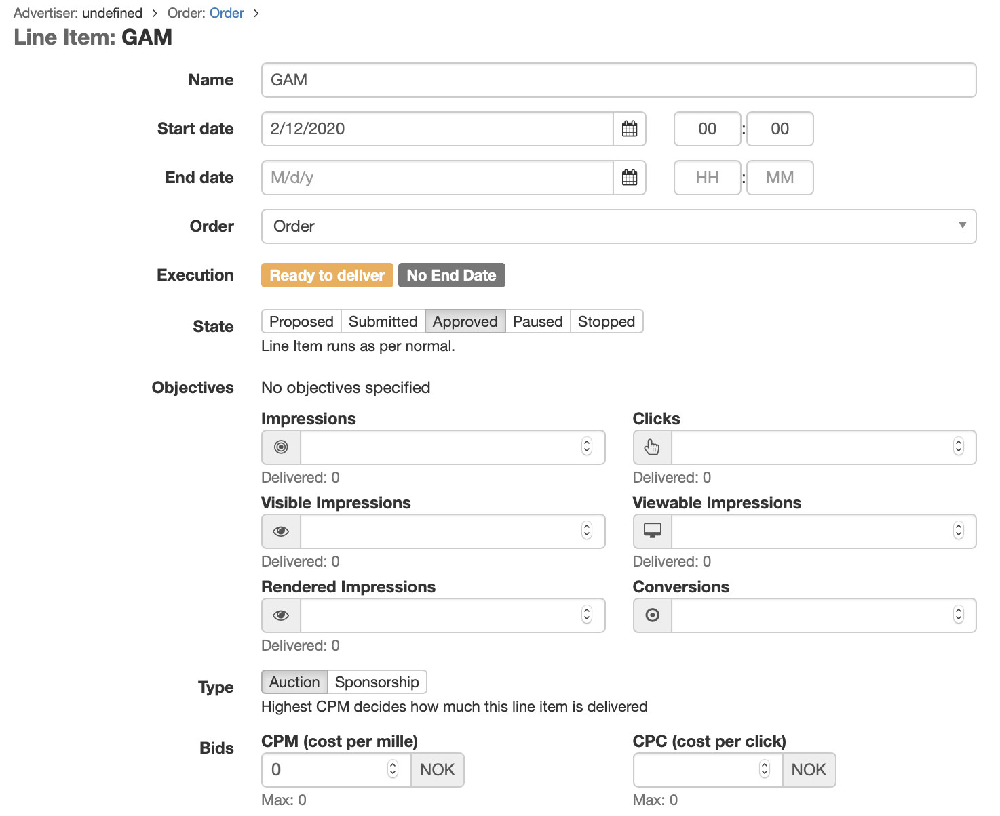

# Google Ad Manager Integration

Adnuntius Advertising allows you to request advertising inventory from your Google Ad Manager (GAM) account, and uses Machine Learning to choose the best floor price to maximise revenue.

This guide describes the required steps to enable this functionality in Adnuntius.


You must have your own GAM account to use this integration.


## Step 1 : Create a Google External Demand Source in Adnuntius

An External Demand Source is required to tell Adnuntius how to connect with your GAM account.

The External Demand Source requires the following information:

- "Google Ad Manager" must be chosen as the External Demand Source
- Your GAM Network Code, specified in the "Publisher ID" field
- The currency that is used in your GAM account
- Bid Levels, which control how bids are converted to key-value targets for GAM (more deatils on this later is provided later in this guide)

## Step 2 : Create a Google External Ad Unit

You create External Ad Units in Adnuntius to connect with your GAM Ad Units.

Each External Ad Unit requires:

- The External Demand Source (created in step above)
- The GAM Ad Unit ID
- The size of the GAM Ad Unit

## Step 3 : Create a Google Line Item (in Adnuntius)

You must create a Line Item in Adnuntius that competes in the Adnuntius auction and controls when the system will check for external inventory from GAM.

You can use all of the standard targeting and tiers etc within Adnuntius on the Line Item.

You should specify a CPM bid of 0, as the actual bidding will be dynamically adjusted by Adnuntius based upon the available demand from GAM.

The Creative for your Line Item must be configured with:

- An "External" Creative Type
- The Google External Demand Source (created in Step 1 above)
- External Ad Unit Targeting to at least one of the GAM Ad Units (created in Step 2 above)

## Step 4 : Create Google Line Items (in GAM)

The configuration described so far ensures that Adnuntius will request ads from GAM whenever it determines that the demand from Google will bid higher than the internal inventory. For this to work, however, you *must* have created line-items in GAM to handle the case when there are **no ads** returned from Google when Adnuntius makes a request.

The requests to GAM arriving from Adnuntius will include a key-value that specifies one of the *Bid Levels* (configured in step 1 above). The key name is `adnFloor`, and the value is numeric with two decimal places, e.g. `1.50`. You **must** create multiple Google line-items which target each of the configured Bid Levels using the associated key-value. For example, if you have configured bid levels:

`0.5, 1, 1.5, 2, 2.5, 3, 3.5, 4`

then you must create eight line-items in GAM with one targeting `adnFloor=0.50`, another targeting `adnFloor=1.00`, another targeting `adnFloor=1.50` and so on.

For each of the created line-items, that entered bid must match the specific targeting, so the line-item targeting `adnFloor=3.50` should have a CPM bid of 3.50.

