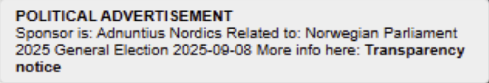

# Political - PII

For political advertisment it's important that the personal identifiable information is kept private and that a political ad can't be used for generating a profile on the user. This is a document describing the steps Adnuntius takes to be compliant. The following information will be based upon that a user have never seen an ad from Adnuntius before.

<figure><figcaption></figcaption></figure>

### Request

A request is passed to Adnuntius with the following:

1. IP address
2. User Agent
3. Publisher provided information

### Parsing request

When Adnuntius receives a request the system will do the following:

1. Resolve the IP address to a location based on an IP table lookup. This is used to select basic ads, but it will not be used for political ads. Political ads will be selected based on the country selected for the site owning the ad unit that gets requested. Location targeting is therefore not used for political ads.
2. User agent is used to detect the current device of the user to ensure that if a political ad is targeted to a mobile device or desktop, it will be served to the correct device type.
3. A publisher can pass contextual information to Adnuntius  ie. category of the page, keywords, key values etc.

### Ad selection

If a political ad is selected based on, country of origin, user agent and the current pacing of the campaign in Adnuntius. We ensure that there are no cookies written on the client if it's a political ad. We also reduce the targeting types that can be used when a user books an ad. These are the targeting types that can be used for political ads. None of these targeting types are considered PII.

1. Device targeting
2. Publisher targeting
3. Site targeting
4. Site country targeting
5. Ad unit targeting
6. Contextual: semantic, category, keyword
7. URL targeting
8. Date targeting

### Response

Adnuntius only allows images and video to be delivered as creatives. These are then hosted by Adnuntius to ensure that we have full control over the entire chain of what gets delivered back to the client. No third parties are used in the creative delivery.

