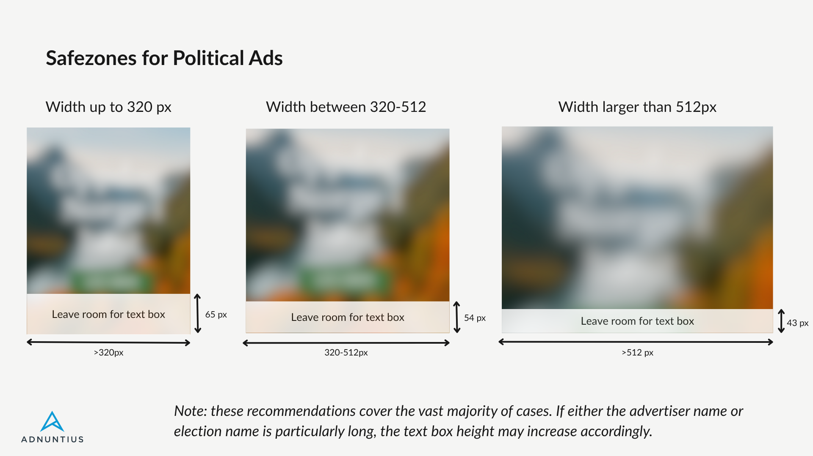

# Ad specification for political ads

We offer two ways to do political ads in our system to make sure that no cookies are set on the client.

* Image ads
* Video ads

These also come as high impact ads, but we still need to host the material in our ad server.

### Image ads

Format: GIF, JPG, PNG, SVG

Max file size: 550kb

### Video ads

Format: MP4, WebM, mov

Max file size: 50 Mb

### Safe zones


Test the overlay with your campaign information using our [Safe Zone Calculator](https://codepen.io/Kweh/full/pvEwjob/full).


The overlay is anchored to the bottom of the ad and spans the full width of the creative.&#x20;

The overlay height is not fixed. It adjusts automatically to fit the required disclosure text. Height will vary depending on the following factors:

* **Advertiser Legal Name** The full legal name of the advertiser must be displayed. Longer names will cause the overlay to grow vertically.
* **Election Name and/or Date** The name of the election and election date associated with the campaign is.&#x20;
* **PII-based Targeting Disclosure** If _Personally Identifiable Information_ is used for audience targeting, an additional disclosure line is required. This adds to the overall height of the overlay.

#### Browser rendering considerations

Minor variations in overlay height may occur across browsers due to differences in font rendering, line-height calculation, and text scaling. Creatives should account for this by maintaining a conservative safe zone that accommodates slight height fluctuations.

#### Safe zone calculator

To test the overlay with your own campaign details, use the interactive preview tool below. You can enter the advertiser name, election name/date, and toggle PII targeting to see how the overlay renders across different configurations and ad sizes.

[Open Overlay Preview Tool](https://codepen.io/Kweh/full/pvEwjob)

### Example of a political ad

### Safe zone example with no PII

<figure><figcaption></figcaption></figure>

