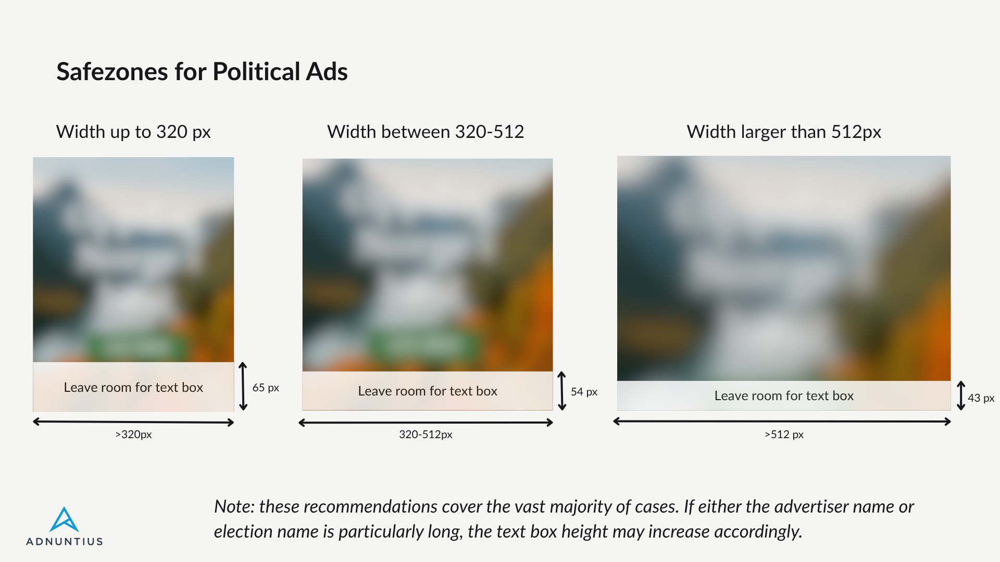

# Ad specification for political ads

We offer two ways to do political ads in our system to make sure that no cookies are set on the client.

* Image ads
* Video ads

These also come as high impact ads, but we still need to host the material in our ad server.

### Display Image ads

Format: GIF, JPG, PNG, SVG

Max file size: 550kb

Safe Zones: see [#safe-zones-display](ad-specification-for-political-ads.md#safe-zones-display "mention")

### Display In-Banner Video ads

Format: MP4, WebM, mov

Max file size: 50 Mb

Safe Zones: see [#safe-zones-display](ad-specification-for-political-ads.md#safe-zones-display "mention")

### Video VAST ads

Format: MP4, WebM, mov

Max file size: 100 Mb

Safe Zones: For VAST video, the disclosure overlay is burned directly into the video file, and is anchored to the **top** of the frame, full width, centered.**Keep the top 15% of the frame free of logos, captions, or key content. For example:**

| Resolution | Safe zone (from top) |
| ---------- | -------------------- |
| 1920×1080  | 162px                |
| 640×360    | 54px                 |
| 1080×1920  | 288px                |

### Display Safe Zones


Test the overlay with your campaign information using our [Political Ad Preview Tool](https://admin.adnuntius.com/political-preview).


The overlay is anchored to the bottom of the ad and spans the full width of the creative.

The overlay height is not fixed. It adjusts automatically to fit the required disclosure text. Height will vary depending on the following factors:

* **Advertiser Legal Name** The full legal name of the advertiser must be displayed. Longer names will cause the overlay to grow vertically.
* **Election Name and/or Date** The name of the election and election date associated with the campaign is.
* **PII-based Targeting Disclosure** If _Personally Identifiable Information_ is used for audience targeting, an additional disclosure line is required. This adds to the overall height of the overlay.

Minor variations in overlay height may occur across browsers due to differences in font rendering, line-height calculation, and text scaling. Creatives should account for this by maintaining a conservative safe zone that accommodates slight height fluctuations.

To test the overlay with your own campaign details, use the interactive preview tool below. You can enter the advertiser name, election name/date, and toggle PII targeting to see how the overlay renders across different configurations and ad sizes.

### Safe zone Display example with no PII

<figure><figcaption></figcaption></figure>

### Example of a political ad

