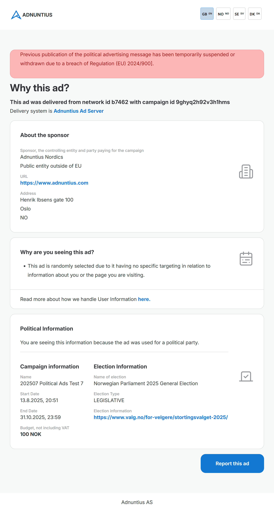

# How to Book a Political Campaign

There are four steps to creating a political campaign:&#x20;

1. Create an Advertiser (if you haven't created it before).&#x20;
2. Create an Order (if you haven't created it before).
3. Create a line item.
4. Create one or more creatives.&#x20;


Please note that political advertising is subject to separate terms and conditions, and may not be activated for your account. Please contact us any time at support@adnuntius.com to learn more.&#x20;


## Buyers Guide



## Before we Begin: Purpose

The Transparency and targeting of political advertising regulation (TTPA) is essentially about providing information to consumers, so the unique steps to political ads booking is about ensuring that this information is presented to users. This information is presented to users on two main objects:&#x20;

1. The label hovering over the creative when it is shown to the user. This label will contain:&#x20;
   1. &#x20;The name of the Advertiser (sponsor, the controlling entity and entity paying for the campaign).
   2. The name of the political event or election (considered mandatory in some countries).
   3. The date of the political event or election (considered mandatory in some countries).&#x20;
   4. The link to more information about the political event or election (considered mandatory in some countries).
2. The information page that displays if the user clicks on the label. This page contains:&#x20;
   1. If the campaign has been reported by a user for breaching transparency rules, a warning label will be shown.
   2. Advertiser information, including the name, URL, address, and whether the advertiser is a public or private entity, and located within or outside the EU.
   3. Any targeting used. If no user data is used we will state that "this ad is randomly selected due to it having no specific targeting in relation to information about you or the page you are visiting".
   4. The campaign's name, start/end date and budget.
   5. The election information (name, type and website link for more information).&#x20;
   6. A link to a reporting form where the user can report the ad.&#x20;


Currently we require that the sponsor, the controlling entity and party paying for the campaign is the same entity (meaning, there is only one object where you can specify the Advertiser information).


The name and address of the Advertiser will be fetched from the [Advertiser in Adnuntius](../adnuntius-advertising/admin-ui/advertising/advertisers.md). The campaign's start/end date, budget, delivery and information political event or election, will be fetched from the [Line Item in Adnuntius](../adnuntius-advertising/admin-ui/advertising/line-items.md).&#x20;

<figure><figcaption>
Example of a label hovering over the creative.
</figcaption></figure>

<figure><figcaption>
Example information page displaying if the user clicks on the creative's label.
</figcaption></figure>

The following guide shows you how to add this information.&#x20;

## 1 Create an Advertiser

If you cannot find your Advertiser under [https://admin.adnuntius.com/advertisers](https://admin.adnuntius.com/advertisers), click on the "New" button in the upper right corner and fill in the information as you would with a normal Advertiser ([as instructed here](../adnuntius-advertising/admin-ui/advertising/advertisers.md)).&#x20;

Here are the fields that are mandatory in order for a political ad to be served:&#x20;

* Advertiser name, so that we can show it on the label and on the transparency notice.&#x20;
* Advertiser URL, so that we can show it on the transparency notice.
* Legal name, so that we can show it on the label and on the transparency notice.&#x20;
* Entity Type, so that we can show it on the transparency notice.
* Contact name and email address, so that we can show it on the transparency notice.
* Address line 1, city, postcode and country, so that we can show it on the transparency notice.


You can also send a form to the advertiser, asking them to provide the information for you - [learn more about the "invite editor" function.](../adnuntius-advertising/admin-ui/advertising/advertisers.md#invite-editor)


## 2 Create an Order

There are no mandatory fields on the Order; just create one as usual as [described here](../adnuntius-advertising/admin-ui/advertising/orders.md).&#x20;

## 3 Create a Line Item

When creating a line item, follow the process [described here](../adnuntius-advertising/admin-ui/advertising/line-items.md). Here are the extra details to be aware of.

* Marketplace buyers: When creating a new line item, select the product "political ads" from the initial selection list where you choose products and countries in which to advertise.&#x20;
* On the line item page, you must choose an election from the dropdown list. You will find this right above the line item's delivery status. When you choose an election we will use a public service, or a proprietary list, to also fetch the election category and link to more information.
* Targeting will be restricted to alternatives using non-personal data. There are therefore some targeting criteria that will not be available when creating political advertising campaigns.&#x20;
* Frequency capping will not work, because we cannot use cookies in political advertising. This prevents us from accurately counting the number of impressions or clicks per user.&#x20;


If you cannot find the election or political event you look for in the dropdown list, tell us what you need on support@adnuntius.com. We fetch a list of elections from a public service, but we are also able to quickly add more on request.&#x20;


## 4 Create One or more Creatives

Lastly, create a creative by following the steps [described here](../adnuntius-advertising/admin-ui/advertising/creatives.md). Creative layouts are limited to image and video assets to ensure complience. See asset specs for political ads [here](ad-specification-for-political-ads.md).&#x20;


The creative preview will render a text box overlay with example values. The text box will be populated correctly when rendered in live enviroment.&#x20;


## Other details

If a user chooses to report an ad, they can do so from the information page (see the button in the bottom right). All reports are first sent to Adnuntius for review. We reserve the right to pause or stop a campaign if we detect any issues or policy violations. The advertiser will be notified in such cases, and the publisher will also be informed about the decision.
