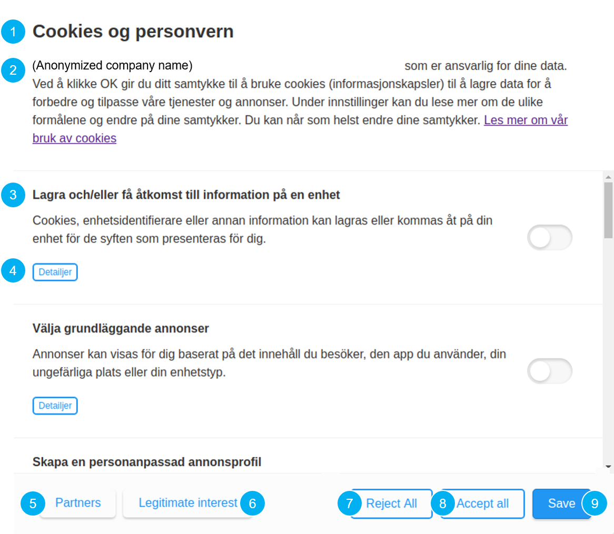

# Privacy

The privacy section allows you to design a consent box that ensures that users are informed about the data you collect and for which purposes, and that they can control whether or not to consent to those purposes. Below is an example consent box.

The box can be styled using CSS in the [Publish section](publish.md), but in general the consent tool is built up by defining texts for specified parts of that box. Below is a numbered list that corresponds to each part of the example consent box below. 

1. Header text.

