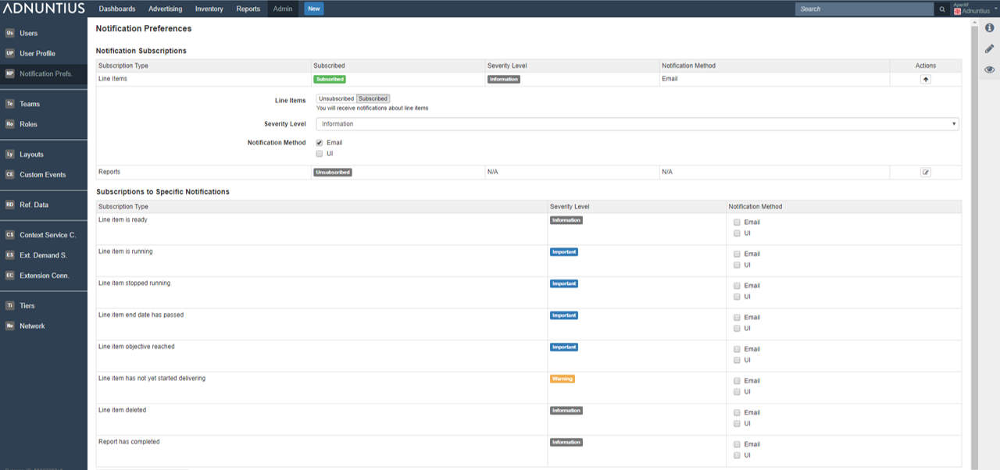
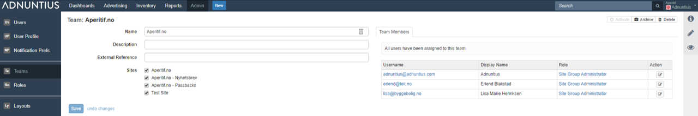
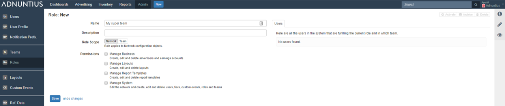
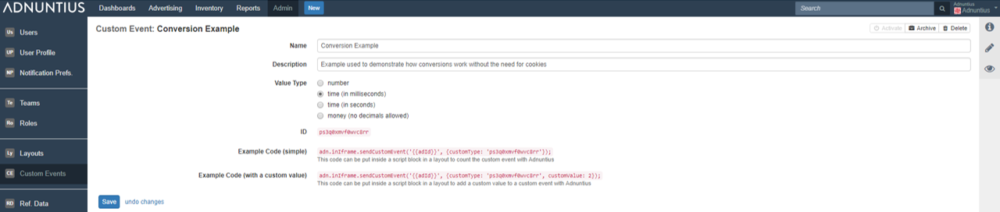
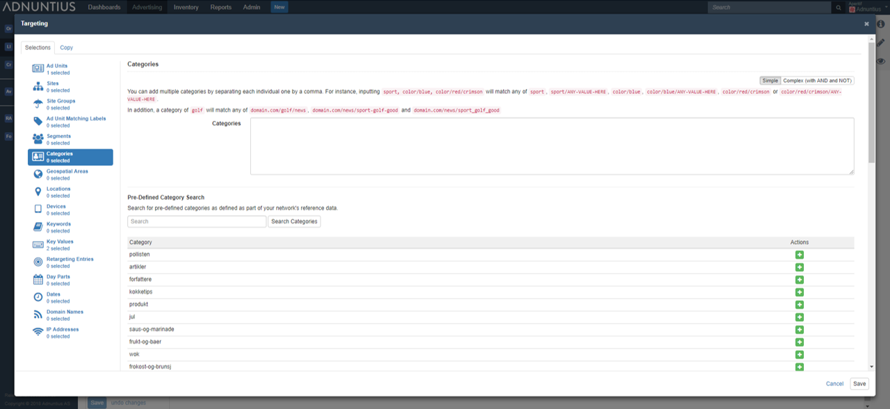

# Admin

## Users and User Profile

The list of users are all users who have rights to perform certain actions \(as defined by [Roles](admin.md#roles)\) to certain parts of content \(as defined by [Teams](admin.md#teams)\). Here is how to create a new user.

**Email address, Name, Display name and Password**: Apply the user's email address, name and password. Display name is the name that will be displayed in the upper right corner of the user interface.


Please note that Adnuntius does not automatically send an email inviting the user to the network. So make sure that you inform the user about his/her new user and password. 


**External reference \(optional\)**: Add an external reference \(optional\) if you want to match the user with the same person in another system. 

**Roles**: A user needs to be assigned with at least two types of roles; a network role and one team role per team. You will find more information on [teams](admin.md#teams) and [roles ](admin.md#roles)later, but in short: 

* A network role \(the top role in the user interface, in light gray\) determines the actions the user will be able to perform to advertisers, earnings accounts, layouts, report templates, users, tiers, custom events, roles and teams \(these are all functions that apply across your entire Adnuntius account\). 
* A team role determines the actions that a user will be able to perform to orders, line items, creatives, sites, ad units, report schedules and reports \(these are all functions that apply to a specific team, i.e. a set of sites\).


If you want to create a user that has no network permissions, you can create a network role where all permissions are unchecked \(and call it for instance "no permissions"\). This way, when you add a user with this network role, they cannot do anything to the network.



In [Admin &gt; Network](admin.md#network) you will be able to determine show or hide sections of the user interface that users do not have permissions to edit.


## Notification Preferences

Notification preferences allow you to subscribe to various changes, meaning that you can choose to receive emails when something happens to line items and reports. You can choose to subscribe to a broad set of line item or report preferences \(top\), or to specific notifications. Here is an explanation to some of the terms.

**Severity level** allows you to choose the types of notifications Adnuntius should send you. For instance, if you choose _Information_ you will receive notifications about line items ready to deliver or starting to run. If you choose _Warning_ you will receive notifications about for instance line items that are not starting to deliver even though it is past the start date. _Error_ will give you notifications about for instance reports that fail to execute for any reason. 

**Notification method** lets you determine if Adnuntius should notify you per email or user interface. If you choose UI then you will find notifications in the right-most column of the user interface, when clicking the "i" icon.

## Teams

Teams let you connect users to a set of sites. This feature allows you to design your organization and account for, for example, multiple sales and ad operations teams that should have access to different sets of inventory. While [Roles ](admin.md#roles)lets you decide the actions that users can take to the inventory they have access to, Teams determines what inventory they can perform those actions on.


You can design multiple teams with the same sites under them. In other words, Adnuntius supports a many-to-many relationship between teams, where a site can belong to several teams. 


**Name, description and external reference**:  Give the team a name and description of your choice. You can also add an external reference \(optional\) if you want to match the team with the same entity in another system.

**Sites**: Add the set of sites you want to put into the team. Once you've chosen one or more sites, and user added to this team will have access to the sites. The actions they can perform to those sites however, will be determined by the role that you assign to the user for this team. 

**Team members** shows you the users currently assigned to this team. 

## Roles

While [Teams](admin.md#teams) determines the inventory a user will have access to, Roles determines what actions that user will be able to take to that inventory. 

**Name and description**: Give the role a name and description \(optional\) of your choice.

**Role scope**: Choose whether this is a network role or a team role. A user must be allowed one network role, which determines the actions that user can take to network-wide functions such as admin functions and report templates. A user can have one team role per team, which determines the actions that user can take to team-specific functions such as publishing inventory and advertising. You can assign or reject the user these permissions: 

* Network role permissions: 
  * Manage Business: Create, edit and delete advertisers and earnings accounts 
  * Manage Layouts: Create, edit and delete layouts 
  * Manage Report Templates: Create, edit and delete report templates 
  * Manage System: Edit the network and create, edit and delete users, tiers, custom events, roles and teams
* Team role permissions: 
  * Manage Advertising: Create, edit and delete orders, line items and creatives
  * Manage Publishing: Create, edit and delete sites and ad units 
  * Run Reports: Create, edit and delete report schedules and generate reports


If you want to create a user that has no network permissions, you can create a network role where all permissions are unchecked \(and call it for instance "no permissions"\). This way, when you add a user with this network role, they cannot do anything to the network.



In [Admin &gt; Network](admin.md#network) you will be able to determine show or hide sections of the user interface that users do not have permissions to edit.


## Layouts

Layouts allow you to create any look and feel to your creative, and to add any event tracking to an ad when it's displayed. When creating a creative, you will always choose a layout, and your layout will be come visible when you have saved your layout. 

**Name, description, category and labels**: Give the layout a name and description \(optional\) of your choice. Categories allow you to group layouts with similar traits so that they are easier to find when later booking a line item and creating a creative.

**Default width and height \(optional\)**: When you add a creative you will always have to provide a width and height to that creative. Creatives using this layout will have these dimensions by default, so that if a creative is usually created with this size, then the process will go quicker. You can of course always change the width and height on a per-creative basis. 

**Layout type** is where you determine whether your new layout will be a third party \(to render third-party creative content\), HTML \(to render HTML creatives that can be uploaded via a zip\), VAST 2.0 \(to render VAST 2 video creatives\), or regular \(to define your own components and render template for making a creative.

**Layout usage** gives you information about the creatives currently using this layout. 

**Render template** is the code that you can insert to determine the look and feel, and any event, of your choice. 

**Components in render template** are assets that you can add to the layout. You can add URLs \(for example click destinations\), text \(for example for native ads\), choices \(for instance choices on whether a video should autoplay or not\), or media \(being images in GIF, JPG or PNG\).

## Custom Events

Custom events let you define any event that you want to track for a creative, line item and order. Custom events can be inserted into layouts to start counting events on a per-creative basis. After creating a custom events you can add them to a line item by including a CPA bid and then choosing your conversion event.

**Name and description**: Give the event a name and description \(optional\) of your choice. 

**Value type** determines what is counted, and you can choose between number \(for example the number of events or conversions\), time in milliseconds or seconds \(for example, the seconds a user holds the cursor over an ad\), or money \(for example the value of a purchase online\). 

**ID and code example**: Once you've created your event, you can paste the code with the ID into a [Layout](admin.md#layouts) to start counting events.

## Reference Data

When you use [category or key value targeting](advertising.md#line-item) on line items or creatives, it can be hard to remember how a categories \(as defined by the URL structure\) are designed on your site, or which key values are being sent with the ad requests. Reference data lets you upload a text file that creates a library of categories and key values that you can choose from, rather than remember them all. 

**Category uploader**: Just create a .txt file where each line specifies a new category that you want to add. 

**Key value uploader**: Just create a .txt file where each line specifies a new key-value entry and commas separate the data like so: mykey, myfirstvalue, mysecondvalue

## Context Service Connections

Some text.

## External Demand Sources

Some text.

## Extension Connections

Some text.

## Tiers

Some text.

## Network

Some text.

