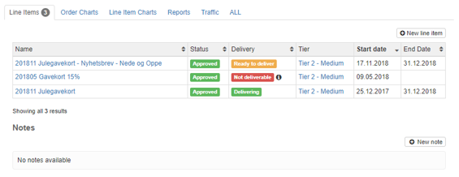
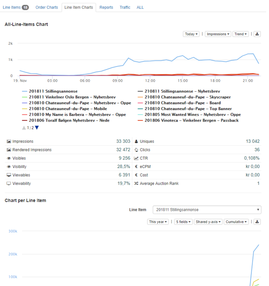
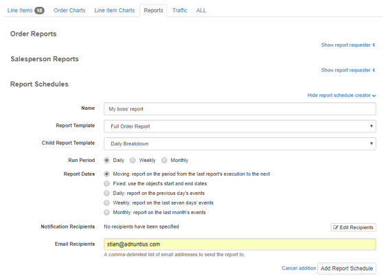

# Advertising

## Concept Summary

| Concept  | Description |
| :--- | :--- |
|  Advertiser | Adding an Advertiser \(for instance; CocaCola\) is a natural first step when a salesperson has closed a sale with a new buyer. Used by publishers selling ads to clients. An advertiser can contain multiple orders. |
| Order | Determines what set of Sites that impressions can be delivered to \(see [Teams ](admin.md#teams)for more information\). One order can contain multiple line items. |
| Line item | Determines start and end dates, delivery objectives \(impressions, clicks or conversions\), pricing, targeting, creative delivery and prioritization. One line item can contain multiple creatives. |
| Creative | The material shown to the end user. Can consist of various assets such as images, text and videos. |
| Reach analysis | An analysis you can run to quickly estimate the volume of matching traffic for a line item.  Does not consider tiers or bids, nor competing line items. |
| Forecast | An analysis you can run to obtain a detailed estimate of available impressions, taking competing line items, targeting, tiers and bids into account. |

## Advertiser

Creating an advertiser is easy. Here are the steps you should take, and some tips on how to do it well.

**Name, description and contact information:** Add a name, an optional description of your choice and the contact information to the advertiser \(optional\). Please note that it is always better to use spacing between words rather than underscores, as searching for items later makes the items easier to find. 

**External reference:** Add an external reference \(optional\) if you want to match the advertiser with the same client in another system. For instance, if Coca Cola is registered in your invoicing system with customer ID 123456, then you may want to add 123456 as an external reference in Adnuntius. This way you can easily recognize two different entries as the same advertiser across two different systems, which may in turn speed up processes like invoicing.

**IAB category:** Adding an IAB category to the client allows you to group advertisers together. Once you've added a category you can send impressions, clicks and conversions to for instance your DMP, and then create segments based users who responded to your campaign. 

**Labels** can be added to make reporting work for you. Let's say you add the label "agency" to a set of advertisers, and then want to run a report only for this group of advertisers. You can then run a report which filters on these advertisers specifically. [Learn how to run reports like this](reports.md#advertising-queries).

## Order

An order determines what set of sites that impressions can be delivered to \(see Admin &gt; Teams for more information\). One order can contain multiple line items. Here is how you create one.

**Name:** Add a name of your choice. Please note that it is always better to use spacing between words rather than underscores, as searching for items later makes the items easier to find.

**Team:** A team contains a set of sites. If your user has access to multiple teams you will be able to choose from a dropdown menu, otherwise only the team available to you will appear. [Learn more about teams.](admin.md#teams)

**Advertiser:** connects the order to a parent advertiser. Used by publishers to keep control of inventory. If you are an advertiser yourself, or don't need this hierarchy, we recommend that you just create one advertiser \(yourself\), and then connect any order to yourself as an advertiser.

**Salesperson \(optional\):** if a salesperson is responsible for the order, then you can assign the order to that user. Please note that you have to create a user for that person; [learn how to create a user](admin.md#users-and-user-profile). After you've done that, you can create reports that can be automatically distributed, showing how much revenue they have earned, their development over time, and more. [Learn how to create salesperson reports](reports.md#reports-report-templates-and-report-schedules). 

**Ad ops \(optional\):** If you have an adops function in your company, then you can add that person to the order. When you have done this you can easily keep overview of who has the responsibility for which orders, as you can see in the image below.

**Labels** can be added to make reporting work for you. Let's say you add the label "autumn" to a set of orders, and then want to run a report only for this group of orders. You can then run a report which filters on these orders specifically. [Learn how to run reports like this](reports.md#advertising-queries).

**Overview, charts and reports**: On the right side of an order page you will find multiple tabs that each has its function.



Provides you with an overview of line items created with this order as a parent. Here you can also quickly create a new line item to reserve inventory \(means that forecasting will take the line item into account when estimating future available space\), and create notes. Notes are text fields that will be viewable by any user that has access to the order. 




Provides you with insights into the order's delivery. You can specify the period you want to look at, the metrics important to you, and how you want the data visualized. Once you have the data interesting to you, you can also download it as an Excel file. 




Provides you with insights into the delivery of line items which are part of this order. You can specify the period you want to look at, the metrics important to you, and how you want the data visualized. Once you have the data interesting to you, you can also download it as an Excel file. 




Allows you to create a report based on a [report template](reports.md#reports-report-templates-and-report-schedules), that can be shared with others as a link. You can also schedule reports to be created regularly, and whoever should receive the reports. Once you have created a scheduled report and added a recipient, Adnuntius will automatically send  reports to recipients, containing the data you have decided on using in the [report template](reports.md#reports-report-templates-and-report-schedules). Here you can see a [demo of how to set up automated reporting](https://www.youtube.com/watch?v=_-OEgPFBq0A&feature=youtu.be). 




## Line Item

A line item determines start and end dates, delivery objectives \(impressions, clicks or conversions\), pricing, targeting, creative delivery and prioritization. Here is how you create one. 

**Name:** Add a name of your choice. Please note that it is always better to use spacing between words rather than underscores, as searching for items later makes the items easier to find.

**Start and end dates:** When creating a line item you can specify when you want your campaign to go live. You can also specify an end date, or you can leave this field blank \(in which case the campaign will run until you choose to stop it\). Please note that if you leave the end date open, smoothing will not work.

**Execution:** Shows the status of the campaign. "_Delivering_" means that the line item is currently delivering impressions. "_Ready to deliver_" means that no additional information is needed for the line item to deliver, but it has not yet started delivering \(for instance because the start date is in the future\). "_Not deliverabl_e" means that no impressions are being delivered; this may be because the line item is paused, or because information like creatives or a bid is missing from the campaign. "_Ended_" means that the line item has passed its end date, or that the objectives have been met, causing the line item to stop delivering.


If your line item has the execution state of "Not deliverable" then first check for a yellow warning box on the top of the line item page. This should give you information about what is missing. You can also try running a diagnostics check, please see further down for more information.


**State** allows you to pause or stop a campaign. "_Approved_" means that the line item will run as soon as the start date is met, all material is added, and everything is ready. "_Paused_" means that the line item won't deliver impressions, but the booked impressions are still taken into consideration when running [reach analyses](advertising.md#reach-analysis) or [forecasts](advertising.md#forecasts). "_Stopped_" means that  the line item won't deliver impressions, and the booked impressions are cancelled \(so the line item will not count into any reach analyses or forecasts\). 

**Objectives** allow you to specify the goal of the campaign. You canchoose  one or multiple objectives. If you choose multiple objectives, then the line item will stop delivering impressions as soon as it reaches _one of its objectives_. Here are the objectives you can choose between:

* Impressions: Counted whenever an ad from the line item has been delivered by our adserver.
* Clicks: Counted whenever a user clicks on an ad. 
* Visible impressions: Counted whenever an ad has one or more pixels shown in the user's viewport.
* Viewable impressions: Counted whenever an ad has 50% or more pixels shown in the user's viewport for 1 second or longer. 
* Rendered impressions: Counted whenever an ad has been rendered onto the page. 
* Conversions: Counted whenever a conversion has happened according to how you want to define a conversion \(read more below\). 

**Type** lets you choose between "_Auction_" and "_Sponsorship_". "_Auction_" means that you will be able to set a CPM price \(cost per thousand ad impressions\), CPC price \(cost per click\) or CPA \(cost per action/conversion\), and then choose whether or not to **smooth** delivery. Enabling smoothing means that the line item will deliver impressions evenly throughout the line item's period \(does not work when the end date is left blank\). "Sponsorship" also allows you to set CPM, CPC and/or CPA prices, but instead of smoothing, you will add a Share of voice. **Share of voice** is the percentage of traffic from whatever targeted inventory that you will allow this line item to receive. 


When specifying a share of voice, take into consideration the [tier ](admin.md#tiers)into which your line item is booked. If a tier is allowed to consume 50% of traffic and is the second highest prioritized tier, then consider that a line item with share of voice 25% then these rules will apply: \(1\) your line item will only get as much traffic as is passed on from the highest tier; and \(2\) your line item will receive 25% of the 50% of traffic that your tier has been assigned with. So your line item will get 25% x 50%x \(100% - what is consumed by higher prioritized tiers\). 


**Rate limits** lets you limit the delivery of a line item. if you choose to add more than one rate limit, then both limits will be added to the line item, essentially adding two restrictions on top of each other. 

* _Type \(line item-wide or per user\)_: Per user means that you will limit the number of impressions or clicks per user for whatever period you set. Line item-wide means that you will limit the delivery of the whole line item.
* _Count_ lets you set the number of impressions or clicks
* _Type_ lets you choose if that number should be impressions, visible impressions, viewable impressions, rendered impressions, or clicks. 
* _Period_ lets you choose whether the X number of impressions or clicks should be per hour, day, week, month or for the line item's lifetime. 

**Targeting** lets you target the line item's impressions to specific users or content. 



sdf



























































## Creatives

## Reach analysis

## Forecasts

