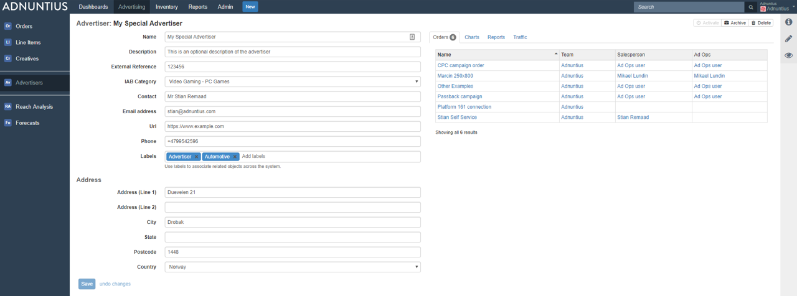

# Advertising

## Concept Summary

| Concept  | Description |
| :--- | :--- |
|  Advertiser | Adding an Advertiser \(for instance; CocaCola\) is a natural first step when a salesperson has closed a sale with a new buyer. Used by publishers selling ads to clients. An advertiser can contain multiple orders. |
| Order | Determines what set of Sites that impressions can be delivered to \(see Teams for more information\). One order can contain multiple line items. |
| Line item | Determines start and end dates, delivery objectives \(impressions, clicks or conversions\), pricing, targeting, creative delivery and prioritization. One line item can contain multiple creatives. |
| Creative | The material shown to the end user. Can consist of various assets such as images, text and videos. |
| Reach analysis | An analysis you can run to quickly estimate the volume of matching traffic for a line item.  Does not consider tiers or bids, nor competing line items. |
| Forecast | An analysis you can run to obtain a detailed estimate of available impressions, taking competing line items, targeting, tiers and bids into account. |

## Advertiser

Creating an advertiser is easy. Here are the steps you should take, and some tips on how to do it well.

**Name, description and contact information:** Add a name, an optional description of your choice and the contact information to the advertiser \(optional\). Please note that it is always better to use spacing between words rather than underscores, as searching for items later makes the items easier to find. 

**External reference:** Add an external reference \(optional\) if you want to match the advertiser with the same client in another system. For instance, if Coca Cola is registered in your invoicing system with customer ID 123456, then you may want to add 123456 as an external reference in Adnuntius. This way you can easily recognize two different entries as the same advertiser across two different systems, which may in turn speed up processes like invoicing.

**IAB category:** Adding an IAB category to the client allows you to group advertisers together. Once you've added a category you can send impressions, clicks and conversions to for instance your DMP, and then create segments based users who responded to your campaign. 

**Labels:** Labels can be added to make reporting work for you. Let's say you add the label "agency" to a set of advertisers, and then want to run a report only for this group of advertisers. You can then run a report which filters on these advertisers specifically. 

## Order

An order determines what set of sites that impressions can be delivered to \(see Admin &gt; Teams for more information\). One order can contain multiple line items.

