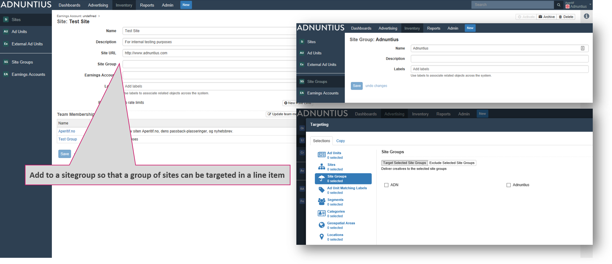

# Inventory

## Concept Summary

| Name | Description |
| :--- | :--- |
| Ad Unit | A placement that serves an ad. It is a snippet of code placed on a website or within another adserver to request an ad from Adnuntius. |
| Site | A site with a given name, that gathers a set of ad units, and connects them to an earnings account. |
| Earnings account | A container for earnings generated by a set of sites. Sites are usually grouped per publisher. |
| Site Group | A group of sites, making ad targeting to a publisher \(or other group of sites\) easier. |
| External Ad Unit | A placement connecting programmatic ads to an ad unit, enabling you to serve ads from an SSP with a server-side connection. |

## Earnings Account

An earnings account is a label that aggregates earnings that one or more sites have made. The purpose is to enable you to choose how you want to consolidate earnings from certain sites into one or more earnings accounts. 


A site can only have one earnings account, as registering the same earnings multiple places would result in the wrong earnings numbers. However, an earnings account may belong more than one site.


**Name, description and address**: Give the earnings account a name and description \(optional\) of your choice. It is always better to use spacing between words rather than underscores, as searching for items later makes the items easier to find. You can also add an address to the account \(optional\).

**External reference:**  Add an external reference \(optional\) if you want to match the earnings account with the same account in another system. For instance, if you are an ad network working with publishing partners, and a publisher is registered in your invoicing system with customer ID 123456, then you may want to add 123456 as an external reference in Adnuntius. This way you can easily recognize two different entries as the same account across two different systems, which may in turn speed up processes like invoicing.

**Revenue share**: If you are an ad network or a marketer with publishing partners, where the publisher is entitled to a share of revenues or spending on their sites, then you can specify that revenue share here. For instance; if you add 10% as revenue share, this means that you award the publisher 10% of whatever is spent on the sites. 

**Labels** can be added to make reporting work for you. Let's say you add the label "Norway" to a set of earnings accounts, and then want to run a report only for this set of accounts. You can then run a report which filters on these accounts specifically. [Learn how to run reports like this](reports.md#publishing-queries).

## Site

Sites are objects that represent the site to which an ad unit belongs. It is thus a container for ad units, and also connects ad units \(and their earnings\) to earnings accounts. 

**Name, description and site URL**: Give your site a name and description \(optional\) of your choice. It is always better to use spacing between words rather than underscores, as searching for items later makes the items easier to find. The site URL \(optional\) helps you quickly visit the site in question, but does not impact any form of targeting. 

**Site group \(optional\)**: connect the site to a group of sites to make targeting of multiple sites easier. [Read more about site groups](inventory.md#site-group). 

**Earnings account \(optional\)**: If the site is part of a publishing group, then you can connect this and other sites to a common earnings account. When you have done so, the earnings account will aggregate revenues made by these sites. [Learn more about earnings accounts](inventory.md#earnings-account). 

**Labels** can be added to make reporting work for you. Let's say you add the label "publishing-inc" to a set of sites, and then want to run a report only for this group of sites. You can then run a report which filters on these sites specifically. [Learn how to run reports like this](reports.md#publishing-queries).

**Rate limits** allows you to limit the traffic \(viewable/visible/rendered/regular impressions and clicks\) that a site or ad unit receives in a given timeframe. This can be useful if you are a marketer or ad network that is given a set impressions for instance monthly for a set price. You can set multiple rate limits.


If you provide a label to rate limits, you will limit the traffic for any line item with that same label. If you do not provide a label, then all line items will stop delivering to the site or ad unit after the set amount is reached. 


**Team membership:**  A team contains a set of sites and is used to control users' access to one or more sites. If your user has access to multiple teams you will be able to choose from multiple sites when clicking "Update team membership", otherwise only the team available to you will appear. [Learn more about teams.](https://docs.adnuntius.io/documentation/~/drafts/-LRqZ7HD-p07mcKQLMfS/primary/user-interface-guide/admin#teams)​


While we cover teams in greater detail in the admin section, a team determines what content a user will have access to. A [Role ](admin.md#roles)on the other hand, defines the actions that user can take to that content. 


**Overview, charts and reports**: On the right side of a site's page you will find multiple tabs that each has its function. 



An overview of ad units belonging to the site. From here you can also create new ad units. 




Site charts provides you with insights about the site's performance for whichever period you would like. Choose the period, the metrics, and the visualization of the data to design the charts you want to see. You can also see the line items that delivered to the site in the period. 




Ad unit charts provides you with insights about the site's ad unit performance for whichever period you would like. Choose the period, the metrics, and the visualization of the data to design the charts you want to see. You can also see the line items that delivered to the site, and for each ad unit, in the period.




Allows you to create a report based on a [report template](reports.md#reports-report-templates-and-report-schedules), that can be shared with others as a link. You can also schedule reports to be created regularly, and whoever should receive the reports. Once you have created a scheduled report and added a recipient, Adnuntius will automatically send reports to recipients, containing the data you have decided on using in the [report template](https://docs.adnuntius.io/documentation/~/drafts/-LRqZ7HD-p07mcKQLMfS/primary/user-interface-guide/reports#reports-report-templates-and-report-schedules). Here you can see a [demo of how to set up automated reporting](https://www.youtube.com/watch?v=_-OEgPFBq0A&feature=youtu.be).




## Site Group

Site groups make it easier to target a group of sites when targeting a line item or creative. The process is as follows: 

1. Create a site group with a name, description \(optional\) and labels \(optional\) of your choice. For instance - "Adnuntius". It is always better to use spacing between words rather than underscores, as searching for items later makes the items easier to find.
2. Next, go to the sites you want to group, and choose a site group.
3. After this, when you create a line item or creative and want to target it, you will find "Adnuntius" as a criteria under "Site Groups". Once you've chosen this, then all sites under "Adnuntius" are targeted.

## Ad Units 

An Ad unit is a placement that serves the content onto a page. It is a snippet of code placed on a website or within another adserver to request content from Adnuntius. If you're a developer and want to know the properties of the ad tag - or adn.js as we call it - see this page: [https://admin.adnuntius.com/adn](https://admin.adnuntius.com/adn)

**Name and description**: Give the ad unit a name and description \(optional\) of your choice. It is always better to use spacing between words rather than underscores, as searching for items later makes the items easier to find.

**Minimum and maximum width and height**: You can add a range of dimensions to ensure that an ad unit can serve any size between your min and max constraints. For example, if your ad unit has minimum 728x90 and maximum 1000x400 pixels, then any creative with width between 728 and 1000, and between 90 and 400 pixels can be served. If you would serve a 1000x300 creative inside this ad unit, the ad unit shrinks by default to 1000x300. 

**Page size and columns**: Page size determines the number of creatives that can be shown inside your ad unit. For instance, if you have a 1000x300 ad unit and page size of 3, then the ad unit may \(depending on what provides the highest value\) serve for instance three 300x100 creatives inside this ad unit. Columns lets you determine the number of columns you allow ads to be served in. 


If you leave the page size and columns fields blank, then Adnuntius will serve any number of ads and columns inside the ad unit \(of course without exceeding the size constraints\).


## External Ad Unit

Some text.

