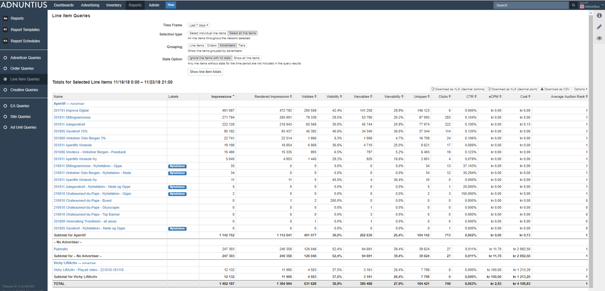

# Reports

## Reports, Report Templates, and Report Schedules

**Reports** is an overview of the reports that have run in the past. This overview allows you to quickly retrieve and report that the system has generated, and to open them. 

**Report schedules** is an overview of all reports that have been scheduled to run. 

**Report templates** allow you to determine how a\(n automatically generated\) report by Adnuntius should look like, regarding the insights it should produce, using which metrics. Here is how you create a template.

**Name, description and logo:** Give the report template a name and description \(optional\) of your choice. If you have [uploaded a logo in the Admin &gt; Network section](admin.md#network), you can also preview the logo that will be used in reports when they are generated. 

**Report template type**: Choose the report type you want to create based on this template. For example, if you choose "line item", then this template will be made available for users when they create a report for line items. The types you can choose between: 

* Line item
* Order
* Salesperson
* Advertiser
* Ad unit
* Site
* Site group
* Earnings account
* Network \(creates day-by-day breakdown of all metrics per advertiser, per line item, per ad unit\).

**Report components** are widgets you can add to the template to display reporting data. After you've chosen one or more widgets you can decide which metrics \(impressions, viewables, clicks, earnings etc\) that you want to show inside that widget. Example: If you are a publisher intending to automatically send reports to advertisers, perhaps you don't want to show the earnings? If this is the case, you can disable earnings from being shown.


You can show one report component several times in the same template by choosing it, saving, clicking "Add report component" again, and then choosing it again. This may be useful if you for instance want to split up daily breakdown charts, and have one of them display clicks and clickrates, and another one display impressions and viewables. 


## Advertising Queries

Advertising queries are reports you can run to get an overview of all advertisers, orders, line items or creatives that have been running in your chosen time period. Here is how you run a query.

**Time frame**: Use any time frame, determining how far back you want to look.

Selection type: 

•Impressions: An impression of an ad.•Rendered Impressions: An ad that has been rendered on page.•Visibles: An ad that has shown one or more pixels in the viewport.•Visibility: Share of impressions that were visible.•Viewables: Ad ad that has 50% or more of its pixels shown in the viewport for 1 second or longer.•Viewability: Share of impressions which are viewable.•Uniques: Unique users \(browsers\).•Clicks: Clicks on an ad.•CTR: Clickrate.•eCPM: \(effective\) cost per thousand ad impressions.•Cost: The revenue generated over the period.•Average Auction Rank: If more than one ad is shown in an ad unit, what is the average rank of this line item?

## Publishing queries

Some text. 

