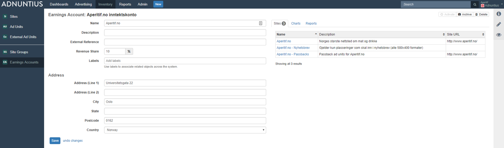

# Earnings Accounts

## Earnings Account

An earnings account is a label that aggregates earnings that one or more sites have made. The purpose is to enable you to choose how you want to consolidate earnings from certain sites into one or more earnings accounts. 


A site can only have one earnings account, as registering the same earnings multiple places would result in the wrong earnings numbers. However, an earnings account may belong more than one site.


**Name, description and address**: Give the earnings account a name and description \(optional\) of your choice. It is always better to use spacing between words rather than underscores, as searching for items later makes the items easier to find. You can also add an address to the account \(optional\).

**External reference:**  Add an external reference \(optional\) if you want to match the earnings account with the same account in another system. For instance, if you are an ad network working with publishing partners, and a publisher is registered in your invoicing system with customer ID 123456, then you may want to add 123456 as an external reference in Adnuntius. This way you can easily recognize two different entries as the same account across two different systems, which may in turn speed up processes like invoicing.

**Revenue share**: If you are an ad network or a marketer with publishing partners, where the publisher is entitled to a share of revenues or spending on their sites, then you can specify that revenue share here. For instance; if you add 10% as revenue share, this means that you award the publisher 10% of whatever is spent on the sites. 

**Labels** can be added to make reporting work for you. Let's say you add the label "Norway" to a set of earnings accounts, and then want to run a report only for this set of accounts. You can then run a report which filters on these accounts specifically. [Learn how to run reports like this](../reports.md#publishing-queries).

