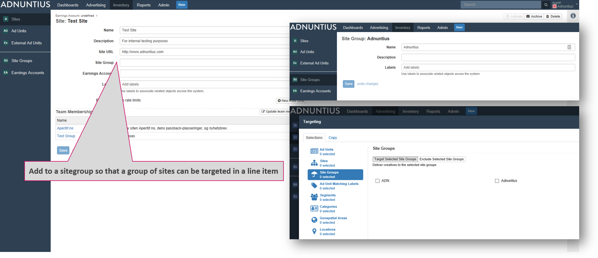

# Site Groups

## Site Group

Site groups make it easier to target a group of sites when targeting a line item or creative. The process is as follows: 

1. Create a site group with a name, description \(optional\) and labels \(optional\) of your choice. For instance - "Adnuntius". It is always better to use spacing between words rather than underscores, as searching for items later makes the items easier to find.
2. Next, go to the sites you want to group, and choose a site group.
3. After this, when you create a line item or creative and want to target it, you will find "Adnuntius" as a criteria under "Site Groups". Once you've chosen this, then all sites under "Adnuntius" are targeted.

