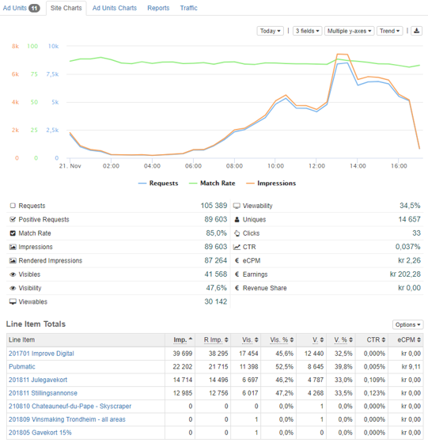
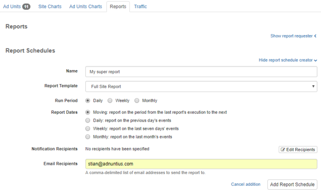

# Sites

## Site

Sites are objects that represent the site to which an ad unit belongs. It is thus a container for ad units, and also connects ad units \(and their earnings\) to earnings accounts. 

**Name, description and site URL**: Give your site a name and description \(optional\) of your choice. It is always better to use spacing between words rather than underscores, as searching for items later makes the items easier to find. The site URL \(optional\) helps you quickly visit the site in question, but does not impact any form of targeting. 

**Site group \(optional\)**: connect the site to a group of sites to make targeting of multiple sites easier. [Read more about site groups](./#site-group). 

**Earnings account \(optional\)**: If the site is part of a publishing group, then you can connect this and other sites to a common earnings account. When you have done so, the earnings account will aggregate revenues made by these sites. [Learn more about earnings accounts](./#earnings-account). 

**Labels** can be added to make reporting work for you. Let's say you add the label "publishing-inc" to a set of sites, and then want to run a report only for this group of sites. You can then run a report which filters on these sites specifically. [Learn how to run reports like this](../reports.md#publishing-queries).

**Rate limits** allows you to limit the traffic \(viewable/visible/rendered/regular impressions and clicks\) that a site or ad unit receives in a given timeframe. This can be useful if you are a marketer or ad network that is given a set impressions for instance monthly for a set price. You can set multiple rate limits.


If you provide a label to rate limits, you will limit the traffic for any line item with that same label. If you do not provide a label, then all line items will stop delivering to the site or ad unit after the set amount is reached. 


**Team membership:**  A team contains a set of sites and is used to control users' access to one or more sites. If your user has access to multiple teams you will be able to choose from multiple sites when clicking "Update team membership", otherwise only the team available to you will appear. [Learn more about teams.](https://docs.adnuntius.io/documentation/~/drafts/-LRqZ7HD-p07mcKQLMfS/primary/user-interface-guide/admin#teams)​


While we cover teams in greater detail in the admin section, a team determines what content a user will have access to. A [Role ](../admin.md#roles)on the other hand, defines the actions that user can take to that content. 


**Overview, charts and reports**: On the right side of a site's page you will find multiple tabs that each has its function. 



An overview of ad units belonging to the site. From here you can also create new ad units. 




Site charts provides you with insights about the site's performance for whichever period you would like. Choose the period, the metrics, and the visualization of the data to design the charts you want to see. You can also see the line items that delivered to the site in the period. 




Ad unit charts provides you with insights about the site's ad unit performance for whichever period you would like. Choose the period, the metrics, and the visualization of the data to design the charts you want to see. You can also see the line items that delivered to the site, and for each ad unit, in the period.




Allows you to create a report based on a [report template](../reports.md#reports-report-templates-and-report-schedules), that can be shared with others as a link. You can also schedule reports to be created regularly, and whoever should receive the reports. Once you have created a scheduled report and added a recipient, Adnuntius will automatically send reports to recipients, containing the data you have decided on using in the [report template](https://docs.adnuntius.io/documentation/~/drafts/-LRqZ7HD-p07mcKQLMfS/primary/user-interface-guide/reports#reports-report-templates-and-report-schedules). Here you can see a [demo of how to set up automated reporting](https://www.youtube.com/watch?v=_-OEgPFBq0A&feature=youtu.be).




