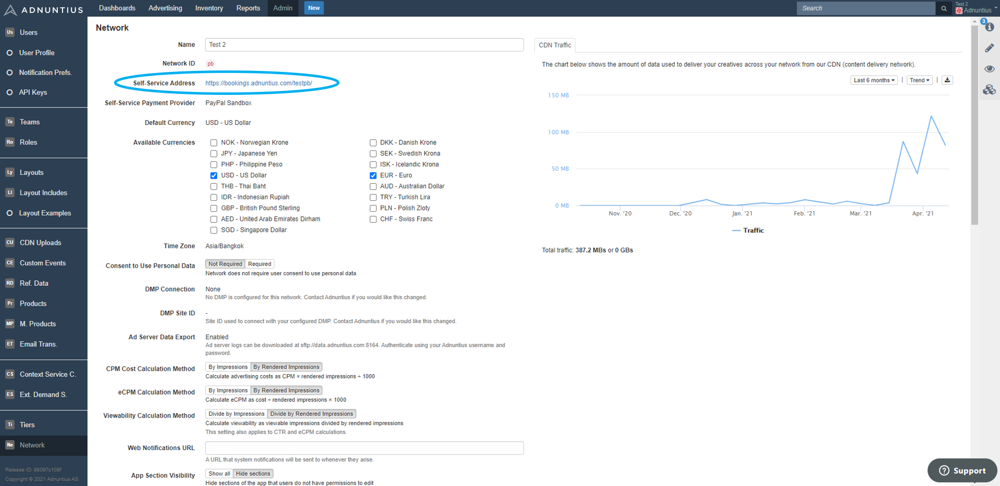

# Whitelabeling

Adnuntius allows its customers to whitelabel the ad tags and/or the user interfaces. This has the following benefits:

* Ad requests sent from the same network domain as the page content can help reduce the number of ad impressions lost due to ad blocking software \(although it is not always guaranteed to beat all ad-blocking methods\).
* The Adnuntus platform will appear to be yours; we provide the technology while you own the appearance and brand of user interfaces. 

## Self-Service Portal

The self-service portal allows for you to use your own domain. As part of [the onboarding process](onboarding-guides/adnuntius-self-service/), here is how you ensure that users can find your self-service portal under your domain rather than ours. For the purposes of this instruction we will assume that the your domain is pubdomain.net, and that you want the self-service portal to be accessible at selfservice.pubdomain.net. This **must** be replaced with your actual domain and address when following the instructions. 

1. Go to [https://admin.adnuntius.com/admin/network](https://admin.adnuntius.com/admin/network) and find the link to your self-service portal. See below for where to find it. 
2. In your DNS, create/add a CNAME for selfservice.pubdomain.net and point it to the link to your self-service portal that you got from point 1. 
3. Inform us that this is done by sending us a short message at support@adnuntius.com, and we will complete the process on our end.



## Admin Portal

You can whitelabel admin.adnuntius.com. For the purposes of this instruction we will assume that the your domain is pubdomain.net, and that you want the admin portal to be accessible at admin.pubdomain.net. This **must** be replaced with your actual domain and address when following the instructions. 

1. In your DNS, create/add a CNAME for admin.pubdomain.net and point it to admin.adnuntius.com. 
2. Inform us that this is done by sending us a short message at support@adnuntius.com, and we will complete the process on our end.

## Ad Tags

Ad requests sent from the same network domain as the page content can help reduce the number of ad impressions lost due to ad blocking software \(although it is not always guaranteed to beat all ad-blocking methods\). For the purposes of this instruction we will assume that the your domain is pubdomain.net. This **must** be replaced with your actual domain when following the instructions. 

**Step 1.** The [CNAME ](https://en.wikipedia.org/wiki/CNAME_record)records in the table below must be configured to point to Adnuntius servers.

| Name | Record Type | Value |
| :--- | :--- | :--- |
| delivery.pubdomain.net | CNAME | delivery.adnuntius.com |
| assets.pubdomain.net | CNAME | 1291047346.rsc.cdn77.org |
| assets2.pubdomain.net | CNAME | 1291047346.rsc.cdn77.org |
| adn.pubdomain.net | CNAME | 1548354739.rsc.cdn77.org |

**Step 2.** Once you have configued the CNAME records as described above, please inform us at support@adnuntius.com **before** continuing to step 3. It is critical that you do not continue following these instructions until you have been informed that the necessary configuration in Adnuntius has been completed.

**Step 3**. The Adnuntius Ad tags must be modified so that the white-label addresses are used. The table below provides a comparison between a “standard” tag and a modified tag.

Standard tag:

```text
<div id="adn-aaabbbccc" style="display:none"></div>
<script src="https://cdn.adnuntius.com/adn.js" async></script>
<script>window.adn = window.adn || {}; adn.calls = adn.calls || []; adn.calls.push(function() { adn.request({ adUnits: [ {auId: '0000000aaabbbccc' } ]}); });</script>
```

Modified tag:

```text
<div id="adn-aaabbbccc" style="display:none"></div>
<script src="https://adn.pubdomain.net/adn.js" async></script>
<script>window.adn = window.adn || {}; adn.calls = adn.calls || []; adn.calls.push(function() { adn.request({ dn: 'pubdomain.net', adUnits: [ {auId: '0000000aaabbbccc' } ]}); });</script>
```

Please note: Standard tags will continue to function without modification, they will just not use the configured white-label addresses.

